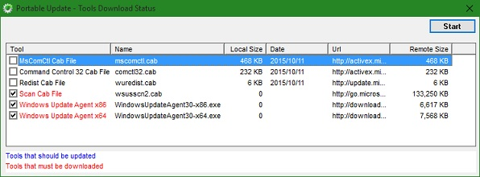
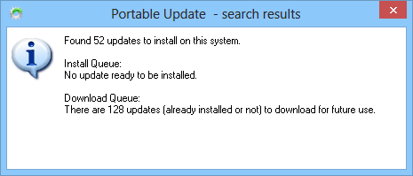
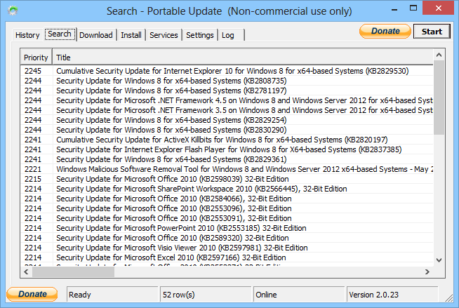

+++
title = "تعلم ويندوز 10.. طريقة تثبيت التحديثات بدون الحاجة الى الإنترنت"
date = "2015-10-11"
description = "تعرفنا في الدرس السابق من سلسلة تعلم ويندوز 10 على طريقة إزالة تثبيت التحديثات يدويا؛ وفي درس اليوم ستتعرف عزيزي القارئ على طريقة سحرية لتحديث ويندوز 10 بدون الحاجة الى الاتصال الدائم بالإنترنت"
categories = ["مهارات رقمية",]
tags = ["موقع لغة العصر"]

+++

تعلم ويندوز 10.. طريقة تثبيت التحديثات بدون الحاجة الى الإنترنت
تعرفنا في الدرس السابق من سلسلة تعلم ويندوز 10 على "طريقة إزالة تثبيت التحديثات يدويا"؛ وفي درس اليوم ستتعرف عزيزي القارئ على طريقة سحرية لتحديث ويندوز 10 بدون الحاجة الى الاتصال الدائم بالإنترنت.

كل ما ستحتاج اليه لتنفيذ هذه الحيلة هو برنامج **[Portable](http://www.portableupdate.com/) Update** وهو برنامج بسيط لا يحتاج للتثبيت، يقوم بالبحث في قاعدة بيانات التحديثات، ثم يتيح لك اختيار ما تريد تحميله وتثبيته من التحديثات المتوافرة، أفضل مميزات هذا البرنامج هو أنه يقوم بإعطائك الملفات التنفيذية لتثبيت التحديث، فيمكنك تثبيته بطريقة يدوية بدون الحاجة إلى اتصال بالإنترنت، كما يمكنك نسخ ملفات التحديث وتثبيتها على أي جهاز آخر يعمل بويندوز.

**أنظمة التشغيل التي يعمل عليها البرنامج:**

-   Microsoft Windows 10;
-   Microsoft Windows 8.1;
-   Microsoft Windows Server 2012;
-   Microsoft Windows Server 2012 R2;
-   Microsoft Windows 8;
-   Microsoft Windows 7;
-   Microsoft Windows Server 2008 R2;
-   Microsoft Windows Server 2008;
-   Microsoft Windows Embedded POSReady 2009;
-   Microsoft Windows Xp starting from Sp3;
-   Microsoft Windows Vista;
-   Microsoft Windows Server 2003;
-   Microsoft Windows 2000 starting from SP4;

1. قم بتحميل البرنامج من [هنا](http://www.portableupdate.com/).

2. قم بفك ضغط البرنامج ثم قم بفتحه، ستظهر لك الواجهة كما بالصورة:

3. سيقوم البرنامج الآن بتحميل الملفات الضرورية للتحديثات.

4. بعد تحميل الملفات بالخطوة السابقة، ستظهر لك قائمة التحديثات المتاحة، قم باختيار التحديثات التي تريد تحميلها.

5. ستظهر لك نافذة جديدة بها كافة تفاصيل التحديثات التي سيتم تحميلها أو تثبيتها.

6. يمكنك الدخول إلى التبويب Search للبحث عن تحديث محدد وتحميله.

---

هذا الموضوع نٌشر باﻷصل على موقع مجلة لغة العصر.

http://aitmag.ahram.org.eg/News/32507.aspx
