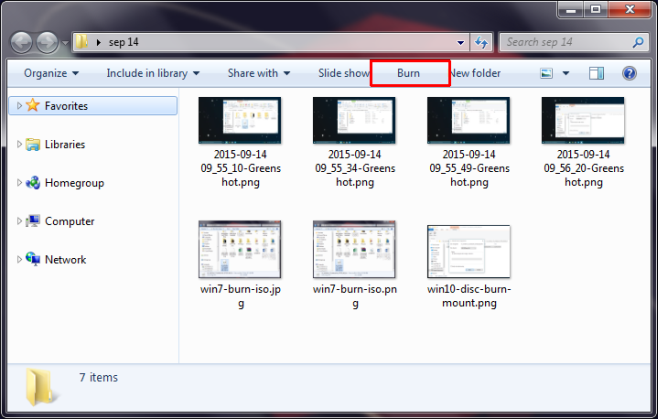
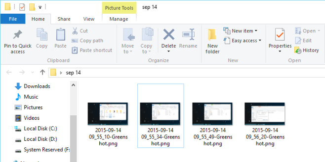
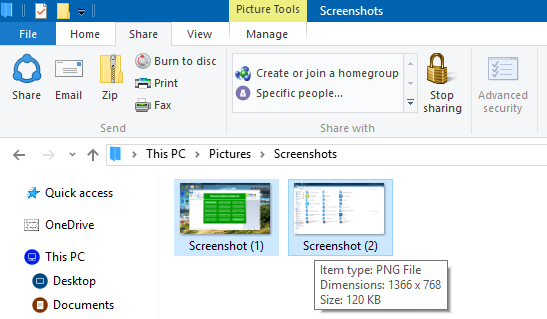
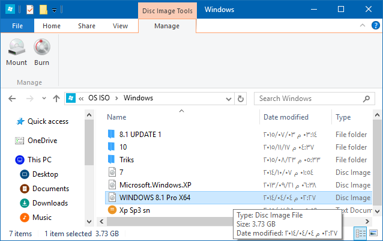
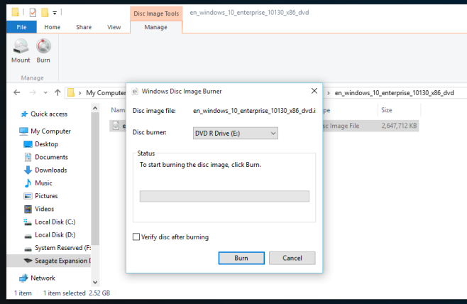

+++
title = "كيفية فتح وحرق ملفات ISO في ويندوز 10"
date = "2015-11-26"
description = "يختلف مدير ملفات ويندوز 10 عن الإصدارات السابقة في التصميم اختلافا كبيرا، من هذه الاختلافات هي اختفاء زر حرق الأسطوانات وملفات ISO، في درس اليوم ستتعرف عزيزي القارئ على طريقة فتح وحرق ملفات ISO في ويندوز 10"
categories = ["ويندوز",]
series = ["ويندوز 10"]
tags = ["موقع لغة العصر"]
images = ["images/0.png"]

+++

يختلف مدير ملفات ويندوز 10 عن الإصدارات السابقة في التصميم اختلافا كبيرا، من هذه الاختلافات هي اختفاء زر حرق الأسطوانات وملفات ISO، في درس اليوم ستتعرف عزيزي القارئ على طريقة فتح وحرق ملفات ISO في ويندوز 10.

**أولا: حرق الملفات على أسطوانة:**

في ويندوز 7 كان يمكن للمستخدم حرق الأسطوانات عن طريق زر burn كما بالصورة:

ولكن في ويندوز 10 لم تعد موجودة:

يمكنك الدخول إلى اختيار حرق الملفات على أسطوانة من التبويب Share كما بالصورة:

**ثانيا: فتح صورة** **ISO:**

- قم بتحديد ال ISO الذي تريد فتحه ثم من قائمة Manage اضغط على Mount.

- يمكنك أيضا الضغط بزر الفأرة الأيمن ثم من قائمة Open With اختر Windows-.aspx'>Windows Explorer.

**ثالثا: حرق صورة** **ISO** **على أسطوانة:**

- قم بتحديد ال ISO الذي تريد فتحه ثم من قائمة Manage اضغط على Burn.

---
هذا الموضوع نٌشر باﻷصل على موقع مجلة لغة العصر.

http://aitmag.ahram.org.eg/News/37993.aspx
