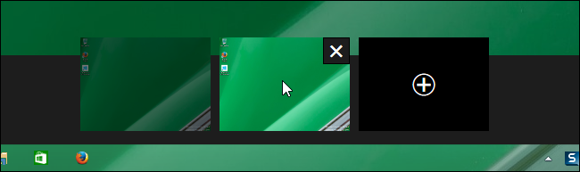
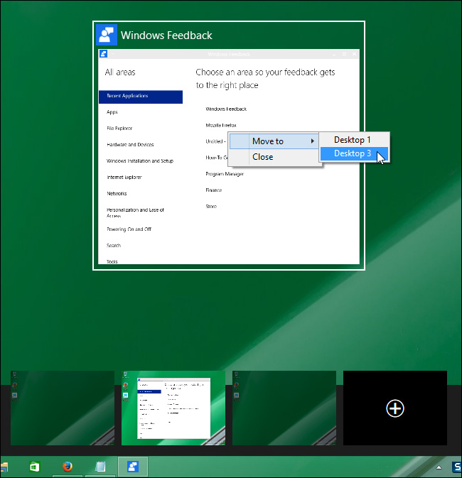
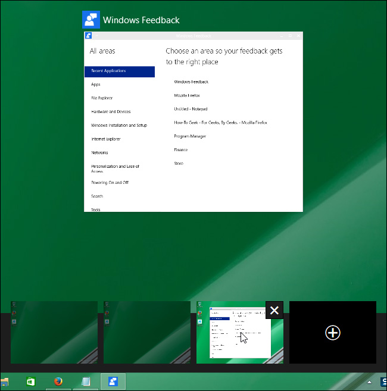

+++
title = "التعامل مع ميزة أسطح المكتب المتعددة في ويندوز 10"
date = "2015-07-09"
description = "ميزة الأسطح المتعددة أو الوهمية قد جاءت الى نظام الويندوز أخيرا، رغم أنها خطوة متأخرة من مايكروسوفت، حيث أن هذه الميزة موجودة بالفعل في أنظمة تشغيل Linux و OS X، في درس اليوم عزيزي مستخدم الويندوز ستتعرف على ميزة أسطح المكتب الوهمية وطريقة التعامل معها"
categories = ["ويندوز",]
series = ["ويندوز 10"]
tags = ["موقع لغة العصر"]

+++

التعامل مع ميزة أسطح المكتب المتعددة في ويندوز 10

ميزة الأسطح المتعددة أو الوهمية قد جاءت الى نظام الويندوز أخيرا، رغم أنها خطوة متأخرة من مايكروسوفت، حيث أن هذه الميزة موجودة بالفعل في أنظمة تشغيل Linux و OS X، ولكن تعد هذه الميزة مفيدة للأشخاص الذين يستخدمون أكثر من برنامج في نفس الوقت، في درس اليوم عزيزي مستخدم الويندوز ستتعرف على ميزة أسطح المكتب 
الوهمية وطريقة التعامل معها.

عند ضغطك على زر Task View يظهر لك بالأسفل مصغرة لسطح المكتب الحالي واختيار لإضافة سطح مكتب جديد كما بالصورة:

ليس المعنى أنه سيتم إضافة سطح مكتب جديد يمكنك إضافة أيقونات
 عليه أو تغيير خلفيته، الخ...، ولكن سيتم إضافة نسخة مطابقة لسطح المكتب 
الخاص بك يمكنك نقل التطبيقات اليها وتوزيعها على الشاشة كما تريد.
اضغط على Add a desktop ليظهر سطح مكتب جديد:

يمكنك ارسال أي من النوافذ المفتوحة الى سطح مكتب آخر عن طريق الضغط على زر Task View ثم الضغط بزر الفأرة الأيمن على النافذة التي تريد نقلها واختيار سطح المكتب الذي تريد النقل اليه.

سيظهر البرنامج في سطح المكتب الجديد:

أيضا عند قيامك بحذف أي من أسطح المكتب الوهمية وبها تطبيقات مفتوحة فلن يتم حذفها بل سيتم نقلها الى سطح المكتب الرئيسي.

---
هذا الموضوع نٌشر باﻷصل على [موقع مجلة لغة العصر](http://aitmag.ahram.org.eg/News/19464/%D8%AF%D8%B1%D9%88%D8%B3/%D8%B4%D8%B1%D8%AD-%D9%88%D8%AA%D8%B9%D9%84%D9%8A%D9%85/%D8%A7%D9%84%D8%AA%D8%B9%D8%A7%D9%85%D9%84-%D9%85%D8%B9-%D9%85%D9%8A%D8%B2%D8%A9-%D8%A3%D8%B3%D8%B7%D8%AD-%D8%A7%D9%84%D9%85%D9%83%D8%AA).

