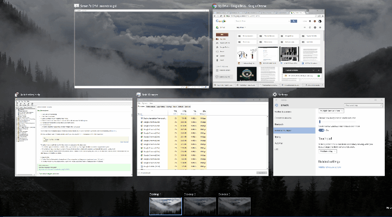

+++
title = "كيفية استخدام اختصارات سطح المكتب الوهمي في ويندوز 10"
date = "2016-03-20"
description = "من أروع المميزات التي أضيفت الى ويندوز 10 هي ميزة أسطح المكتب الوهمية، ولتحقيق أقصى افادة من هذه الخاصية ستتعرف عزيزي القارئ على طريقة استخدامها بواسطة اختصارات لوحة المفاتيح"
categories = ["ويندوز",]
series = ["ويندوز 10"]
tags = ["موقع لغة العصر"]
+++

من أروع المميزات التي أضيفت الى ويندوز 10 هي ميزة أسطح المكتب الوهمية، على الرغم من أنها موجودة في الأنظمة الأخرى منذ زمن، ولتحقيق أقصى افادة من هذه الخاصية ستتعرف عزيزي القارئ على طريقة استخدامها بواسطة اختصارات لوحة المفاتيح.

- كما تعرف عزيزي القارئ: يمكن استخدام ميزة أسطح المكتب الوهمية عن طريق الاختصار Windows+Tab أو عن طريق الضغط على زر Task Switcher الموجود على يمين زر Start.

- استخدام اختصارات سطح المكتب الوهمي:
- 
1- اختصار Windows + Ctrl + السهم اليمين:
بواسطة هذا الاختصار تستطيع الانتقال إلى سطح المكتب الافتراضي التالي.

2- اختصار Windows + Ctrl + السهم اليسار:
بواسطة هذا الاختصار تستطيع الانتقال إلى سطح المكتب الافتراضي السابق.

3- الاختصار Windows + Ctrl + D:
بواسطة هذا الاختصار تستطيع انشاء سطح مكتب افتراضي جديد.

4- الاختصار Windows + Ctrl + F4:
بواسطة هذا الاختصار تستطيع اغلاق سطح المكتب الافتراضي الحالي.

---
هذا الموضوع نٌشر باﻷصل على موقع مجلة لغة العصر.

http://aitmag.ahram.org.eg/News/46527.aspx