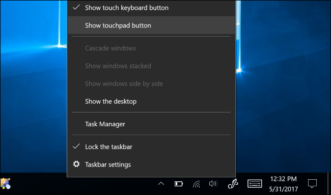
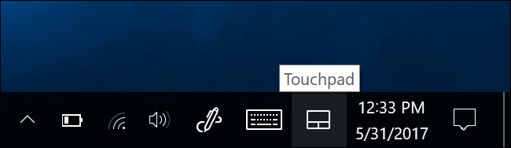
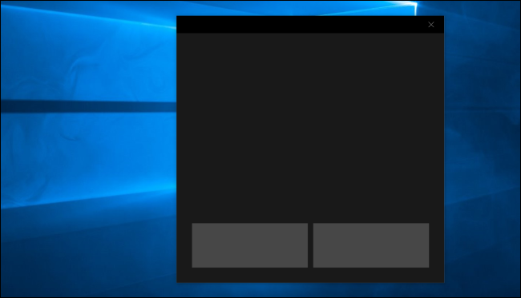
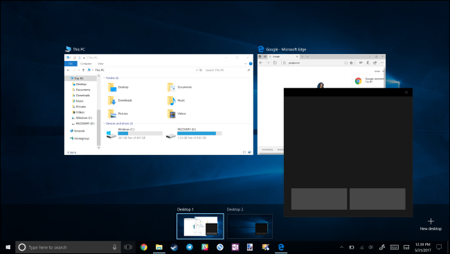
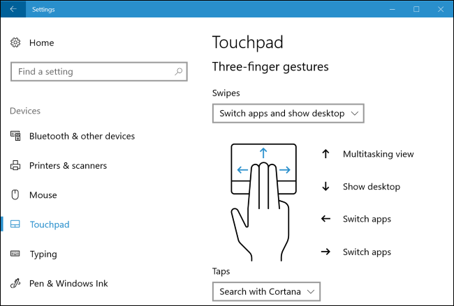

+++
title = "طريقة تفعيل واستخدام لوحة اللمس الافتراضية فى ويندوز 10"
date = "2017-07-30"
description = "أضاف تحديث ويندوز 10 الجديد ميزة لوحة اللمس الافتراضية التي تمكنك عزيزي القارئ من استخدام لوحة لمس .تظهر على الشاشة كما بأجهزة اللاب توب، إليك طريقة تفعيلها واستخدامها على الأجهزة التي تحتوي علي شاشة تعمل باللمس"
categories = ["ويندوز",]
series = ["ويندوز 10"]
tags = ["موقع لغة العصر"]
images = ["images/0.png"]
+++

أضاف تحديث ويندوز 10 الجديد ميزة "لوحة اللمس الافتراضية" التي تمكنك عزيزي القارئ من استخدام لوحة لمس تظهر على الشاشة كما بأجهزة اللاب توب، إليك طريقة.aspx'>طريقة تفعيلها واستخدامها على الأجهزة التي تحتوي علي شاشة تعمل باللمس.

- لتفعيل لوحة اللمس الافتراضية قم بالضغط بزر الماوس الأيمن على شريط المهام ثم اختر "Show touchpad button”.

ولاحظ أن هذا الاختيار لن يظهر لديك في حالة كان جهازك لا يحتوي على شاشة تعمل باللمس.

ستظهر لك أيقونة جديدة على شريط المهام كما بالصورة:

- لإستخدام لوحة اللمس الافتراضية كل ما عليك هو وضع اصبعك على الشاشة والتحكم بكل حرية كما لو أنك تستخدم لوحة لمس عادية، ويمكنك أيضا تحريك نافذة لوحة اللمس الافتراضية إلى أى مكان تريده على الشاشة.

يمكنك الضغط باصبع واحدة لتقوم ب "left-click” أو الضغط باصبعين لتقوم ب "right-click”، ولتحكم أكبر يمكنك السحب بثلاثة أصابع على لوحة اللمس لتنقل إلى Task View لتقوم بالتنقل بين النوافذ المفتوحة.

- وللتحكم في إعدادات لوحة اللمس الافتراضية يمكنك الدخول على تطبيق الإعدادات ثم Devices وبعد ذلك Touchpad screen

---
هذا الموضوع نٌشر باﻷصل على موقع مجلة لغة العصر.

http://aitmag.ahram.org.eg/News/82183.aspx