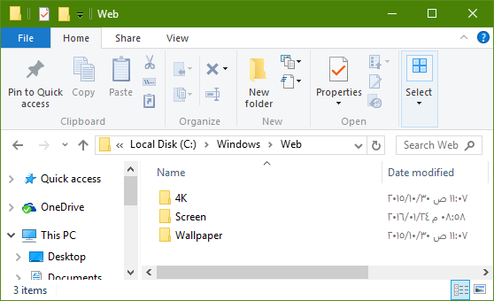
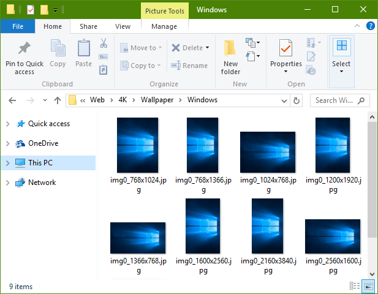
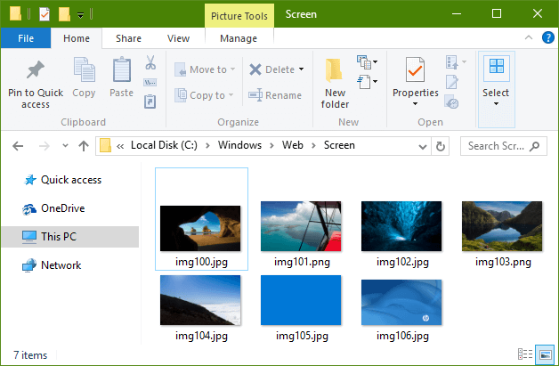
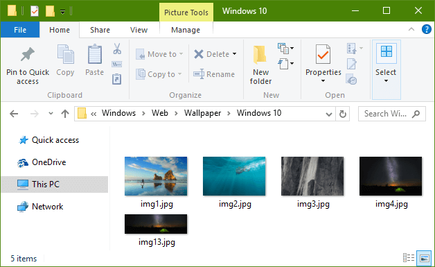

+++
title = "أين يتم حفظ خلفيات ويندوز 10 الافتراضية؟"
date = "2016-06-19"
description = "لعلك تساءلت هذا السؤال يوما ما، فبالرغم من أن ويندوز لا يحتوي العديد من الخلفيات المبهرة ولكنها ليست سيئة أيضا، إذا أردت أن تعرف أين يقوم الويندوز بتخزين خلفياته عالية الدقة إليك الطريقة!"
categories = ["ويندوز",]
series = ["ويندوز 10"]
tags = ["موقع لغة العصر"]
+++

لعلك تساءلت هذا السؤال يوما ما، فبالرغم من أن ويندوز لا يحتوي العديد من الخلفيات المبهرة ولكنها ليست سيئة أيضا، إذا أردت أن تعرف أين يقوم الويندوز بتخزين خلفياته عالية الدقة إليك الطريقة!

يحتوي ويندوز 10 على العديد من الخلفيات عالية الدقة لعل أشهرها هو خلفية Windows Hero، ويحتفظ الويندوز بجميع خلفياته في المسار `C:\Windows\Web`

فبعد الدخول لهذا المسار ستجد ثلاثة مجلدات:

4K: يحتوي على صورة Windows Hero في الكثير من أحجام الشاشة المختلفة، وجميعها عالية الدقة.

Screen: يحتوي على صور شاشة القفل، وإذا أعجبتك أي من هذه الصور كل ما عليك هو نسخها ولصقها في المكان الذي تريد.

Wallpaper: أما هذا المجلد فإنه يحتوي على العديد من الصور المختلفة الموجودة في الويندوز إلى جانب الصور الخاصة بالشركة المصنعة.

---
هذا الموضوع نٌشر باﻷصل على موقع مجلة لغة العصر.

http://aitmag.ahram.org.eg/News/53078.aspx