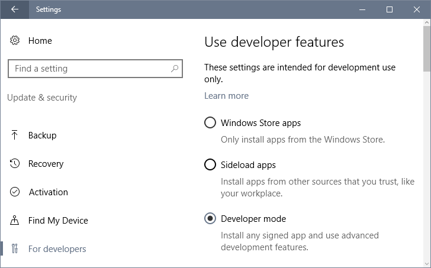
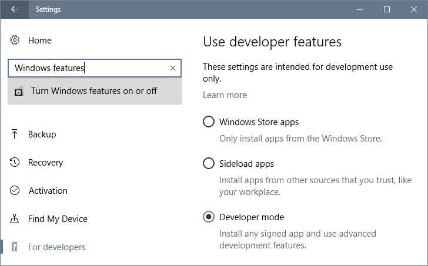
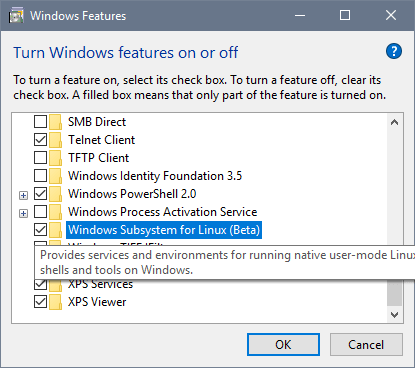
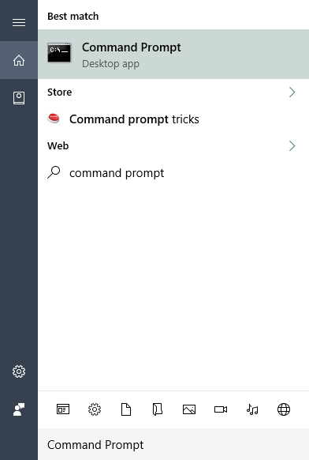
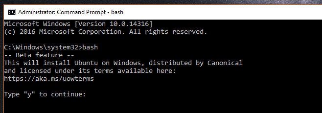
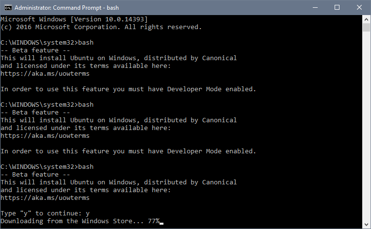

+++
title = "طريقة تفعيل Bash On Windows لتشغيل أوبونتو على ويندوز 10"
date = "2016-08-22"
description = "تعد Bash On Windows من أكبر الإضافات وخصوصا للمطورين، حيث ستمكنهم من استخدام طرفية نظام أوبونتو لينكس بكل سهولة مباشرة من الويندوز."
categories = ["ويندوز", "لينكس",]
series = ["ويندوز 10"]
tags = ["موقع لغة العصر"]
images = ["images/0.png"]
+++

تعد Bash On Windows من أكبر الإضافات وخصوصا للمطورين، حيث ستمكنهم من استخدام طرفية نظام أوبونتو لينكس بكل سهولة مباشرة من الويندوز.

1. قم بالدخول إلى الإعدادات ثم القسم Update & Security ثم التبويب For Developers وقم بتفعيل وضع المطور باختيار Developer Mode.

2. بعد ذلك قم بالبحث عن Windows features واختر Turn Windows features on or off.

3. قم بالنزول إلى الأسفل ثم فعل الاختيار Windows Subsystem for Linux(beta).

4. بعد التفعيل سيطلب الويندوز إعادة التشغيل، قم بذلك.

5. الآن سنقوم بتحميل أوبونتو، قم بفتح موجه الأوامر Command Prompt.

6. ثم قم بكتابة الأمر bash، سيطلب منك كتابة Y للموافقة.

7. انتظر حتى اكتمال تحميل أوبونتو (1 جيجا تقريبا) بعد ذلك ستتمكن من استخدام bash**.**

---
هذا الموضوع نٌشر باﻷصل على موقع مجلة لغة العصر.

http://aitmag.ahram.org.eg/News/58345.aspx