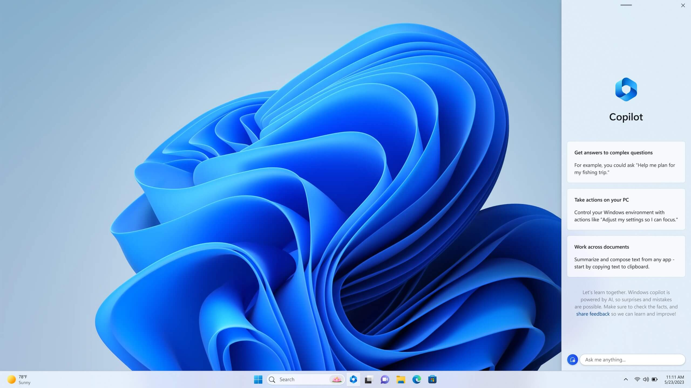
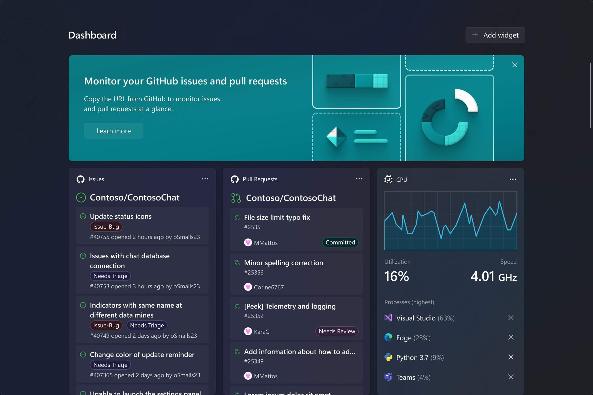

+++
title = "11 ميزة جديدة في تحديث ويندوز 11 23H2"
date = "2023-09-25"
description = "منذ إصدار ويندوز 11 في أكتوبر 2021 ومايكروسوفت تصدر العديد من التحديثات الصغيرة دوريًا، وتحديثًا كبيرًا مرة واحدة سنويًا، وهذا العام نحن على موعد مع التحديث الجديد 23H2 خلال شهر سبتمبر الجاري أو أكتوبر القادم وسيكون متاحًا لكل الأجهزة العاملة بالنظام دون شروط خاصة، ويجلب للويندوز العديد من الميزات الجديدة مثل مساعد الذكاء الاصطناعي Copilot وتغييرات شكلية وتغييرات صغيرة موزعة على مكونات النظام المختلفة."
categories = ["ويندوز",]
tags = ["مجلة لغة العصر"]

+++

منذ إصدار ويندوز 11 في أكتوبر 2021 ومايكروسوفت تصدر العديد من التحديثات الصغيرة دوريًا، وتحديثًا كبيرًا مرة واحدة سنويًا، وهذا العام نحن على موعد مع التحديث الجديد 23H2 خلال شهر سبتمبر الجاري أو أكتوبر القادم وسيكون متاحًا لكل الأجهزة العاملة بالنظام دون شروط خاصة، ويجلب للويندوز العديد من الميزات الجديدة مثل مساعد الذكاء الاصطناعي Copilot وتغييرات شكلية وتغييرات صغيرة موزعة على مكونات النظام المختلفة.

## 1. مساعد الذكاء الاصطناعي Copilot

أكبر ميزة جديدة في التحديث الجديد هي مساعد الذكاء الاصطناعي الجديد الذي أطلقت عليه مايكروسوفت اسم "Windows Copilot"، ويستخدم نفس تقنيات مساعد Bing Chat وMicrosoft 365 Copilot المعتمدة على النموذج اللغوي الضخم GPT-4 لمساعدة المستخدمين في أداء المهام وزيادة الإنتاجية عبر فهم الاستعلامات والأوامر المعقدة والسياق وتقديم حلول واقتراحات.

يستبدل Windows Copilot مساعد Cortana وسيمكن المستخدمين من عمل الكثير من اﻷمور تمامًا مثل Bing Chat، فيمكنك طرح أسئلة معقدة والحصول على إجابات مفصلة بناءً على المعلومات من الإنترنت مثل المساعدة في التخطيط لرحلة، أو معرفة فارق التوقيت بين بلدين، ويمكنك أن تطلب منه تلخيص النصوص والمستندات أو إعادة كتابتها أو تغيير إعدادات الكمبيوتر، وتشغيل الصوتيات. وستجد زر تشغيل Copilot على شريط المهام وبالضغط عليه سيفتح شريطًا جانبيًا يحتوي على نافذة دردشة وسجل المحادثة بينك وبين Copilot.

## 2. مدير ملفات جديد

تعمل مايكروسوفت على تحديث كبير لمدير الملفات في ويندوز 11 يغير الواجهة إلى شكل حديث أكثر يعتمد على نظام التصميم WinUI 3، ويقدم التحديث الجديد واجهة مستخدم رأسية مُعاد تصميمها تشبه إلى حد كبير متصفح الويب فيحتوي الجزء العلوي من التطبيق على التبويبات، وتحتها توجد أزرار التنقل الأمام والخلف والصفحة الرئيسية، بجانب شريط العناوين ومربع البحث، وأسفل شريط العنوان ستجد جميع أوامر مدير الملفات المعتادة، مثل النسخ واللصق والقص.

حدثت مايكروسوفت وفت كذلك تصميم عرض المجلدات والصفحة الرئيسية ونافذة التفاصيل، مما سيجعل مدير الملفات يبدو أكثر اتساقًا مع بقية أجزاء وتطبيقات النظام.

كما أضاف التحديث الجديد ميزة "المعرض" التي ستوفر تجربة مميزة لمشاهدة واستعراض جميع الصور الموجودة على جهازك وتخزين OneDrive، ومزامنتها مع الهاتف عبر تطبيق Phone Link. ويحتوى المعرض على جدول زمني يسمح لك بالتمرير السريع للانتقال إلى صور وقت محدد، ويحتوى كذلك على خيارات الإجراءات السريعة مثل تعديل الصورة باستخدام تطبيق الصور.

## 3. النسخ الاحتياطي

يضيف التحديث الجديد أخيرًا أداة النسخ الاحتياطي السحابي إلى الويندوز، مما سيسهل إجراء النسخ الاحتياطي للإعدادات والملفات والتطبيقات على سحابة OneDrive الخاصة بك يمكنك تشغيلها وقتما تشاء، كما تتيح لك استعادة بياناتك عند إعداد جهاز كمبيوتر جديد أول مرة. وعند تسجيل الدخول إلى حساب مايكروسوفت في أي وقت، سيُعرض على المستخدم الاستعادة من جهاز كمبيوتر سابق واستخدام جميع الإعدادات والتطبيقات بسهولة.

وبالنسبة للتطبيقات المثبتة فيتحكم متجر مايكروسوفت في عملية الاستعادة، مما يعني أن التطبيقات المثبتة عبر المتجر هي فقط التي ستنسخ احتياطيًا ومتاح استعادتها.

## 4. تحسينات شريط المهام

عندما أصدر ويندوز 11 أول مرة ضج المستخدمون بالشكوى من إزالة العديد من خيارات تخصيص شريط المهام مثل إلغاء تجميع النوافذ. ومع التحديث الجديد أصبح ذلك ممكنًا مرة أخرى فيمكن الآن عرض كل مثيل للتطبيق كرمز فردي على شريط المهام وتمييز كل مثيل عبر عنوان النافذة.

## 5. نافذة التحكم في الصوت جديدة

الأداة الجديدة للتحكم في الصوت هي إضافة كبيرة أخرى في هذا التحديث كان المستخدمين يطلبونها منذ سنوات، إذ لا يزال ويندوز 10 وويندوز 11 قبل هذا التحديث يستخدمان أداة التحكم في الصوت القديمة التي تشبه نظام ويندوز XP، وقامت مايكروسوفت أخيرًا بإزالتها وتقديم أداة جديدة لمزج والتحكم في الصوت من شريط المهام داخل لوحة الإعدادات السريعة، لتمكن المستخدم من تغيير مستوى الصوت لمختلف التطبيقات وأجهزة التشغيل بسهولة أكبر، كما يمكن استخدامها عبر اختصار جديد للوحة المفاتيح: Windows + Ctrl + V.

## 6. دعم الملفات المضغوطة بصيغ 7zip وRAR

أضافت مايكروسوفت أخيرًا في هذا التحديث الدعم لصيغ الملفات المضغوطة 7zip وRAR داخل الويندوز، مما يعني أنك لن تضطر إلى تنزيل برامج خارجية للتعامل مع هذه الصيغ، حيث سيكون الويندوز قادرًا على التعامل مع ملفات 7zip وRAR وفك ضغطها أو ضغطها بسهولة عبر القائمة المختصرة للملفات داخل مدير الملفات أو سطح المكتب أو أي مكان آخر، كما أضيف كذلك دعك صيغة .tar وtar.gz وغيرها من الصيغ مفتوحة المصدر.

## 7. التحكم في إضاءة RGB

يأتي التحديث الجديد مع ميزة الإضاءة الديناميكية التي ستعجب اللاعبين كثيرًا، حيث أصبح من الممكن التحكم في ألوان RGB للأجهزة المتصلة بالجهاز مثل الماوس ولوحة المفاتيح والشاشات وغيرها من الأجهزة والملحقات عبر تطبيق الإعدادات دون تنزيل برامج خارجية.

## 8. بيت المطور

لم تنس مايكروسوفت المطورين كذلك في هذا التحديث، حيث أضافت ميزتين جديدتين هما بيت المطور وقرص المطور. يوفر تطبيق بيت المطور Dev Home وسيلة سهلة لإعداد الجهاز الحالي لتطوير البرمجيات عليه، ويعرض حالة الجهاز عبر أدوات مراقبة النظام ومعلومات من موقع GitHub مثل المشروعات وأحدث التغييرات والطلبات. بينما تتيح ميزة قرص المطور Dev Drive إنشاء قسم نظام مخصص لتطوير البرامج بتنسيق ReFS الذي يوفر مزيدًا من الأداء للمشروعات التي تحتوي على عدد ملفات كبير مثل الألعاب أو التطبيقات المعقدة.

## 9. شاشة تطبيق الإعدادات الرئيسية

أعادت مايكروسوفت تصميم الصفحة الرئيسية لتطبيق الإعدادات في هذا التحديث بشكل يسهل الوصول إلى الإعدادات الأكثر استخدامًا، ويعرض التصميم الجديد بطاقات للإعدادات المقترحة وأخرى للموصى بها وفقًا لحالة الاستخدام الخاصة بك.

## 10. تحسينات ميزة المشاركة

يأتي الإصدار الجديد من الويندوز مزودًا بنافذة مشاركة مُعاد تصميمها تحتوي على شريط بحث لإيجاد جهات الاتصال بسهولة ومشاركة الملفات معهم، وتعرض كذلك أجهزة الكمبيوتر القريبة لمشاركة الملفات بسهولة أكبر مع الأجهزة الموجودة على نفس الشبكة التي تستخدمها.

## 11. تحسينات لوحة المكونات المصغرة

كما هي العادة في كل تحديث لويندوز 11، حصلت قائمة البداية على تغييرات جديدة وهذه المرة في لوحة المكونات المصغرة Widgets Board، حيث أصبح باﻹمكان تخصيص طريقة عرض اللوحة والاختيار بين وجود عناصر واجهة مستخدم منفصلة عن موجز الأخبار أو مختلطة معه أو تعطيل موجز أخبار كليًا.

## تغييرات أخرى 

ليس ما ذكر سابقًا هو كل التغييرات الجديدة التي سيتضمنها التحديث، فهناك أيضًا:

- إمكانية اختيار صور شبيهة بالمعروضة ضمن صور Spotlight عند استخدامها في سطح المكتب أو شاشة القفل.

- قفل البرامج بشكل إجباري دون الحاجة لفتح مدير المهام Task Manager.
- إضافة المزيد من الإيموجي المدعومة في Unicode 15 وإعادة تصميم بعضها.
- إضافة المزيد من إعدادات الشبكة مثل الإطلاع على كلمة السر بطريقة أسهل.
- التعامل مع إشعارات التطبيقات بطريقة أكثر ذكاءً بحيث سيخفي النظام إشعارات التطبيقات والبرامج التي لا تتفاعل معها شيئًا فشيئًا حتى يعطلها بشكل نهائي.
- الثيم المظلم في تطبيق الرسام.
- التبديل بين الحاسب المحلي والسحابي ضمن خدمة Windows 365 بسهولة عبر شريط المهام.
- إضافة دعم HDR إلى الخلفيات.

---

هذا الموضوع نُشر باﻷصل في مجلة لغة العصر العدد 317 شهر 09-2023 ويمكن الإطلاع عليه [هنا](https://drive.google.com/file/d/19kzq7D9vmtgeW7c8aUjXcxcbNgxYbjL-/view?usp=drive_link).

