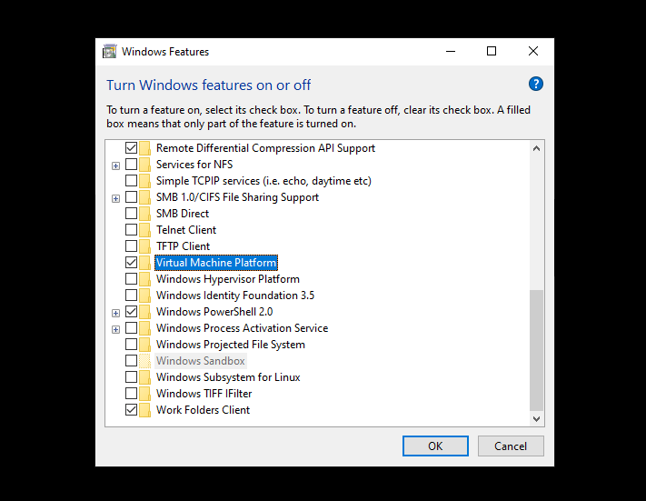
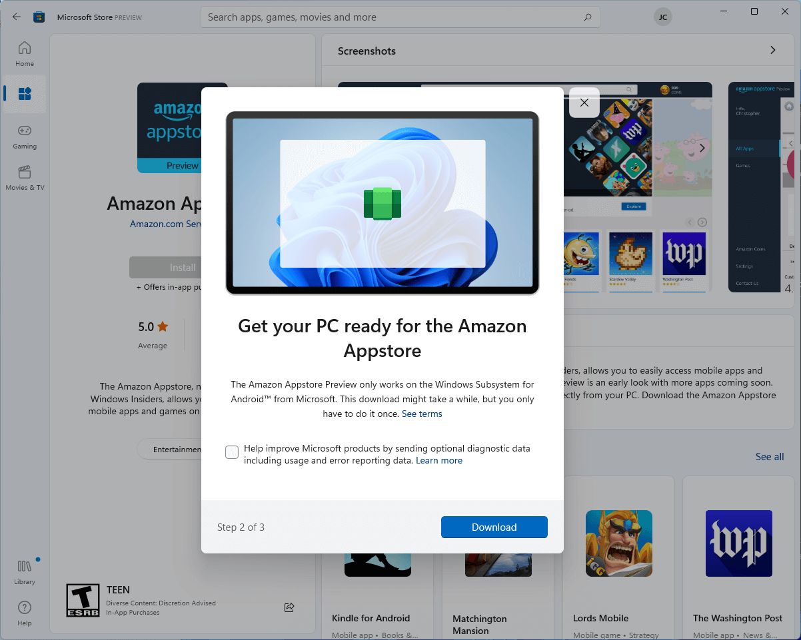
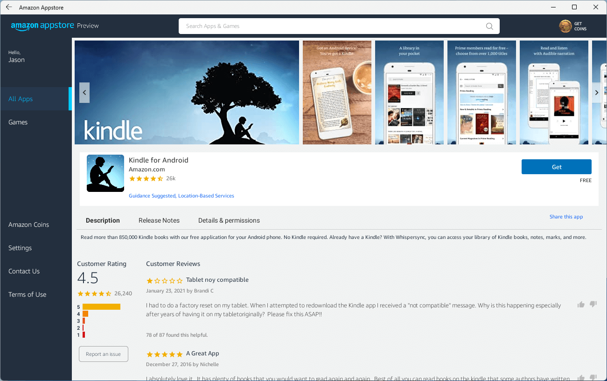
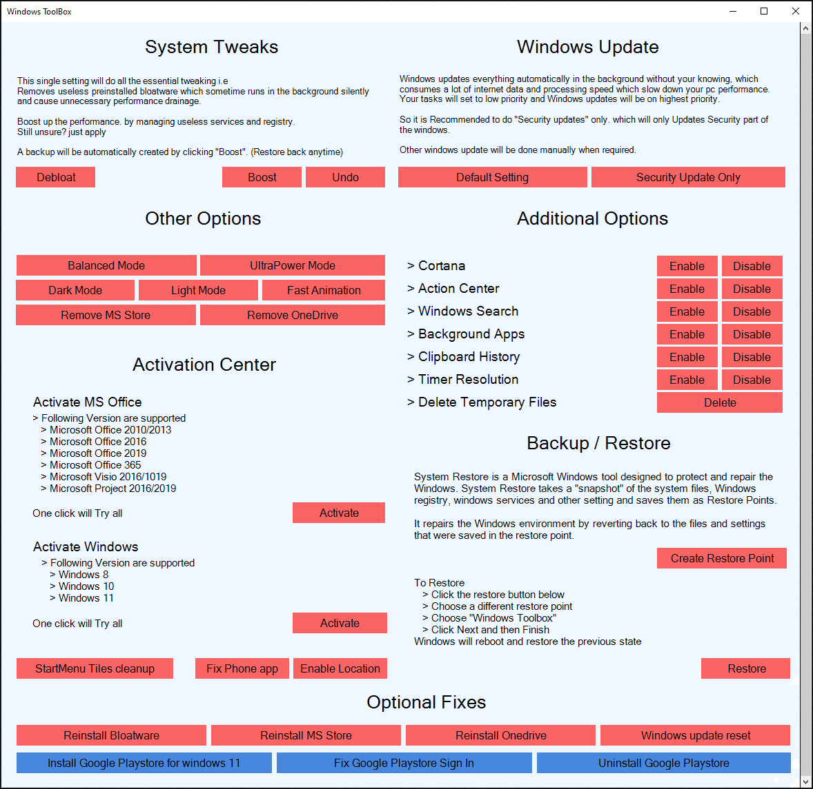
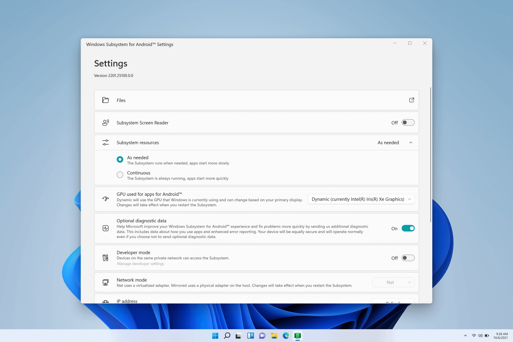
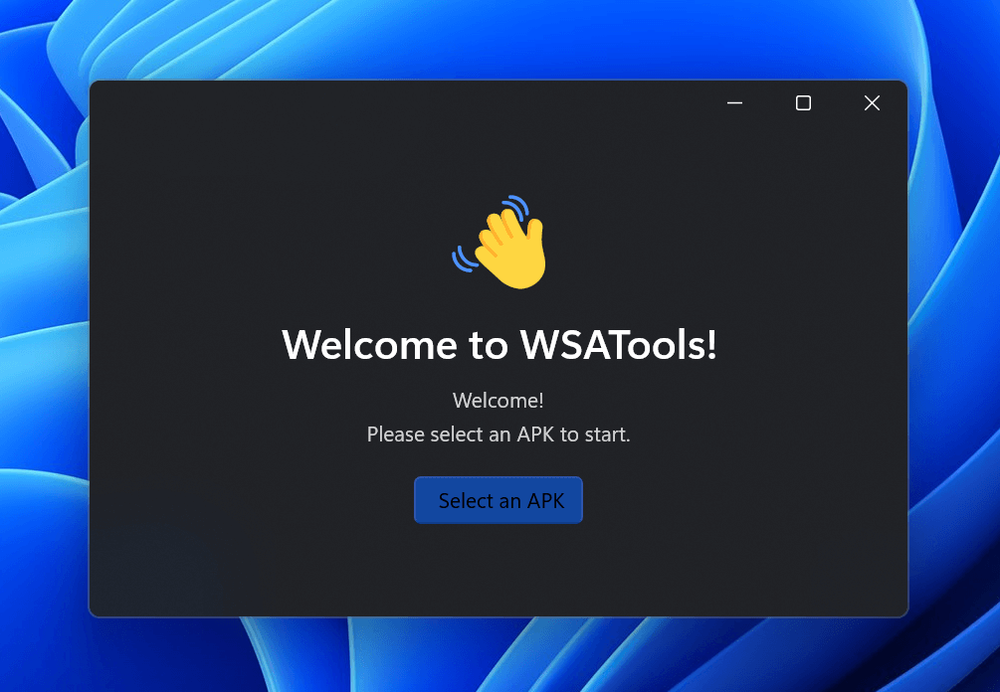
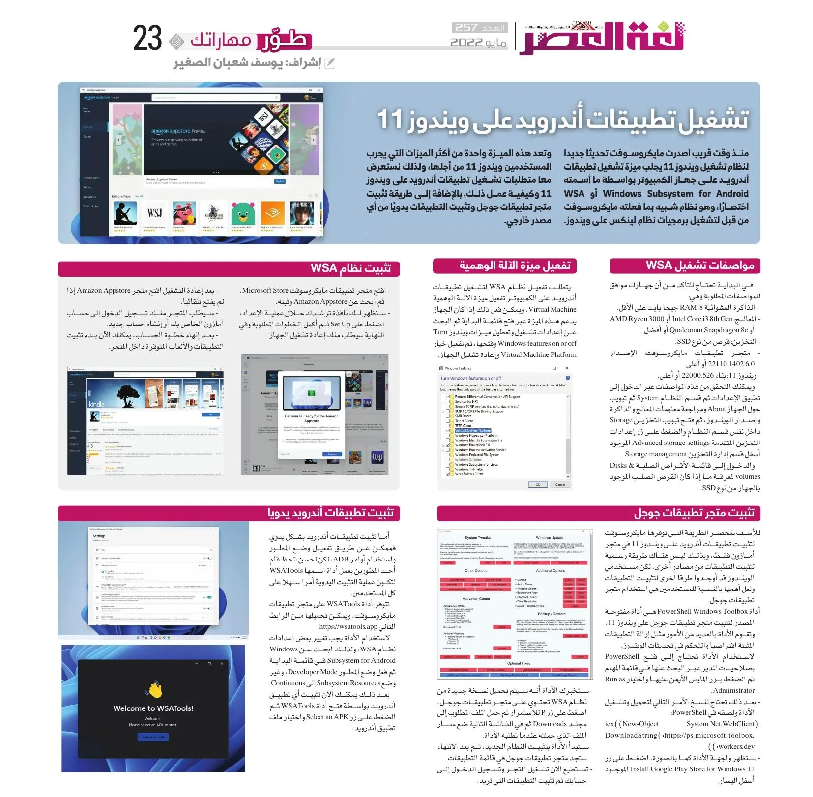

+++
title = "كيفية تشغيل تطبيقات أندرويد على ويندوز 11"
date = "2022-05-01"
description = "منذ وقت قريب أصدرت مايكروسوفت تحديثا جديدا لنظام تشغيل ويندوز 11 يجلب ميزة تشغيل تطبيقات أندرويد على جهاز الكمبيوتر بواسطة ما أسمته Windows Subsystem for Android أو WSA اختصارًا، وهو نظام شبيه بما فعلته مايكروسوفت من قبل لتشغيل برمجيات نظام لينكس على ويندوز. وتعد هذه الميزة واحدة من أكثر الميزات التي يجرب المستخدمون ويندوز 11 من أجلها، ولذلك نستعرض معًا متطلبات تشغيل تطبيقات أندرويد على ويندوز 11 وكيفية عمل ذلك، بالإضافة إلى طريقة تثبيت متجر تطبيقات جوجل وتثبيت التطبيقات يدويًا من أي مصدر خارجي."
categories = ["ويندوز", "مهارات رقمية",]
tags = ["مجلة لغة العصر"]

+++
منذ وقت قريب أصدرت مايكروسوفت تحديثا جديدا لنظام تشغيل ويندوز 11 يجلب ميزة تشغيل تطبيقات أندرويد على جهاز الكمبيوتر بواسطة ما أسمته Windows Subsystem for Android أو WSA اختصارًا، وهو نظام شبيه بما فعلته مايكروسوفت من قبل لتشغيل برمجيات نظام لينكس على ويندوز. وتعد هذه الميزة واحدة من أكثر الميزات التي يجرب المستخدمون ويندوز 11 من أجلها، ولذلك نستعرض معًا متطلبات تشغيل تطبيقات أندرويد على ويندوز 11 وكيفية عمل ذلك، بالإضافة إلى طريقة تثبيت متجر تطبيقات جوجل وتثبيت التطبيقات يدويًا من أي مصدر خارجي.

## مواصفات تشغيل WSA

 في البداية تحتاج للتأكد من أن جهازك موافق للمواصفات المطلوبة وهي:

 - **الذاكرة العشوائية RAM**: 8 جيجا بايت على الأقل.
- **المعالج**: Intel Core i3 8th Gen أو AMD Ryzen 3000 أو Qualcomm Snapdragon 8c أو أفضل.
- **التخزين**: قرص من نوع SSD.
- **متجر تطبيقات مايكروسوفت**: الإصدار 22110.1402.6.0 أو أعلى.
- **ويندوز 11**: بناء 22000.526 أو أعلى.

ويمكنك التحقق من هذه المواصفات عبر الدخول إلى تطبيق الإعدادات ثم قسم النظام System ثم تبويب حول الجهاز About ومراجعة معلومات المعالج والذاكرة وإصدار الويندوز، ثم فتح تبويب التخزين Storage داخل نفس قسم النظام والضغط على زر إعدادات التخزين المتقدمة Advanced storage settings الموجود أسفل قسم إدارة التخزين Storage management والدخول إلى قائمة الأقراص الصلبة Disks & volumes لمعرفة ما إذا كان القرص الصلب الموجود بالجهاز من نوع SSD.

## تفعيل ميزة اﻵله الوهمية

يتطلب تفعيل نظام WSA لتشغيل تطبيقات أندرويد على الكمبيوتر تفعيل ميزة اﻵله الوهمية Virtual Machine، ويمكن فعل ذلك إذا كان الجهاز يدعم هذه الميزة عبر فتح قائمة البداية ثم البحث عن إعدادات تشغيل وتعطيل ميزات ويندوز Turn Windows features on or off وفتحها، ثم تفعيل خيار Virtual Machine Platform وإعادة تشغيل الجهاز.



## تثبيت نظام WSA

- أولا افتح متجر تطبيقات مايكروسوفت Microsoft Store، ثم ابحث عن Amazon Appstore وثبته.
- ستظهر لك نافذة ترشدك خلال عملية الإعداد، اضغط على Set Up ثم أكمل الخطوات المطلوبة وفي النهاية سيطلب منك إعادة تشغيل الجهاز.



- بعد إعادة التشغيل افتح متجر Amazon Appstore إذا لم يفتح تلقائيا.
- سيطلب المتجر منك تسجيل الدخول إلى حساب أمازون الخاص بك أو إنشاء حساب جديد.
- بعد إنهاء خطوة الحساب، يمكنك الآن بدء تثبيت التطبيقات والألعاب المتوفرة داخل المتجر.



## تثبيت متجر تطبيقات جوجل

للأسف تنحصر الطريقة التي توفرها مايكروسوفت لتثبيت تطبيقات أندرويد على ويندوز 11 في متجر أمازون فقط، وبذلك ليس هناك طريقة رسمية لتثبيت التطبيقات من مصادر أخرى، لكن مستخدمي الويندوز قد أوجدوا طرقًا أخرى لتثبيت التطبيقات ولعل أهمها بالنسبة للمستخدمين هي استخدام متجر تطبيقات جوجل.

أداة PowerShell Windows Toolbox هي أداة مفتوحة المصدر لتثبيت متجر تطبيقات جوجل على ويندوز 11، وتقوم الأداة بالعديد من الأمور مثل إزالة التطبيقات المثبتة افتراضيا والتحكم في تحديثات الويندوز.

- لاستخدام الأداة تحتاج إلى فتح PowerShell بصلاحيات المدير عبر البحث عنها في قائمة المهام ثم الضغط بزر الماوس الأيمن عليها واختيار Run as Administrator.

- بعد ذلك تحتاج لنسخ الأمر التالي لتحميل وتشغيل الأداة ولصقه في PowerShell:

```powershell
iex((New-ObjectSystem.Net.WebClient).DownloadString('https://ps.microsoft-toolbox.workers.dev'))
```

- ستظهر واجهة الأداة كما بالصورة، اضغط على زر Install Google Play Store for Windows 11 الموجود أسفل اليسار.



- ستخبرك الأداة أنه سيتم تحميل نسخة جديدة من نظام WSA تحتوي على متجر تطبيقات جوجل، اضغط على زر P للاستمرار ثم حمل الملف المطلوب إلى مجلد Downloads ثم في الشاشة التالية ضع مسار الملف الذي حملته عندما تطلبه الأداة.
- ستبدأ الأداة بتثبيت النظام الجديد، ثم بعد الانتهاء ستجد متجر تطبيقات جوجل في قائمة التطبيقات.
- تستطيع الآن تشغيل المتجر وتسجيل الدخول إلى حسابك ثم تثبيت التطبيقات التي تريد.

## تثبيت تطبيقات أندرويد يدويا

أما تثبيت تطبيقات أندرويد بشكل يدوي فممكن عن طريق تفعيل وضع المطور واستخدام أوامر ADB، لكن لحسن الحظ قام أحد المطورين بعمل أداة اسمها WSATools لتكون عملية التثبيت اليدوية أمرًا سهلا على كل المستخدمين.

تتوفر أداة WSATools على متجر تطبيقات مايكروسوفت، ويمكن تحميلها من الرابط التالي https://wsatools.app

لاستخدام الأداة يجب تغيير بعض إعدادات نظام WSA، ولذلك ابحث عن Windows Subsystem for Android في قائمة البداية ثم فعل وضع المطور Developer Mode، وغير وضع Subsystem Resources إلى Continuous.



بعد ذلك يمكنك الآن تثبيت أي تطبيق أندرويد بواسطة فتح أداة WSATools ثم الضغط على زر Select an APK واختيار ملف تطبيق أندرويد.



---

هذا الموضوع نُشر باﻷصل في مجلة لغة العصر العدد 257 شهر 05-2022 ويمكن الإطلاع عليه [هنا](https://drive.google.com/file/d/1n8EllAi7C5QPloMRXfvy1bQIGUbh64L-/view?usp=sharing).



