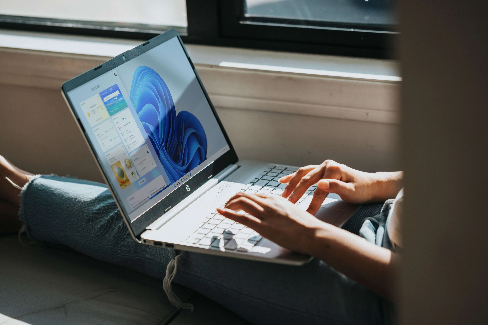
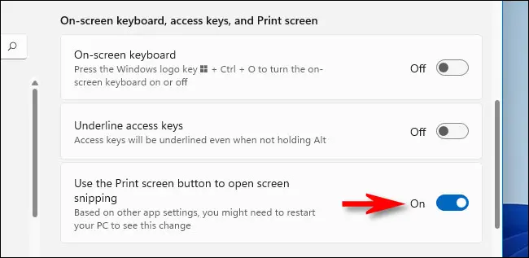
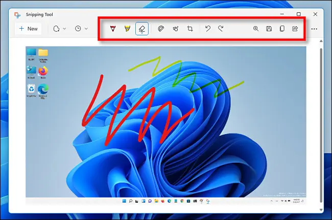
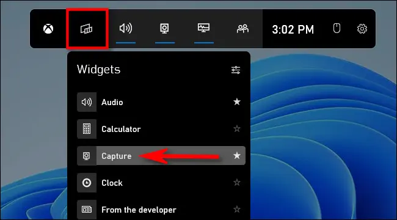
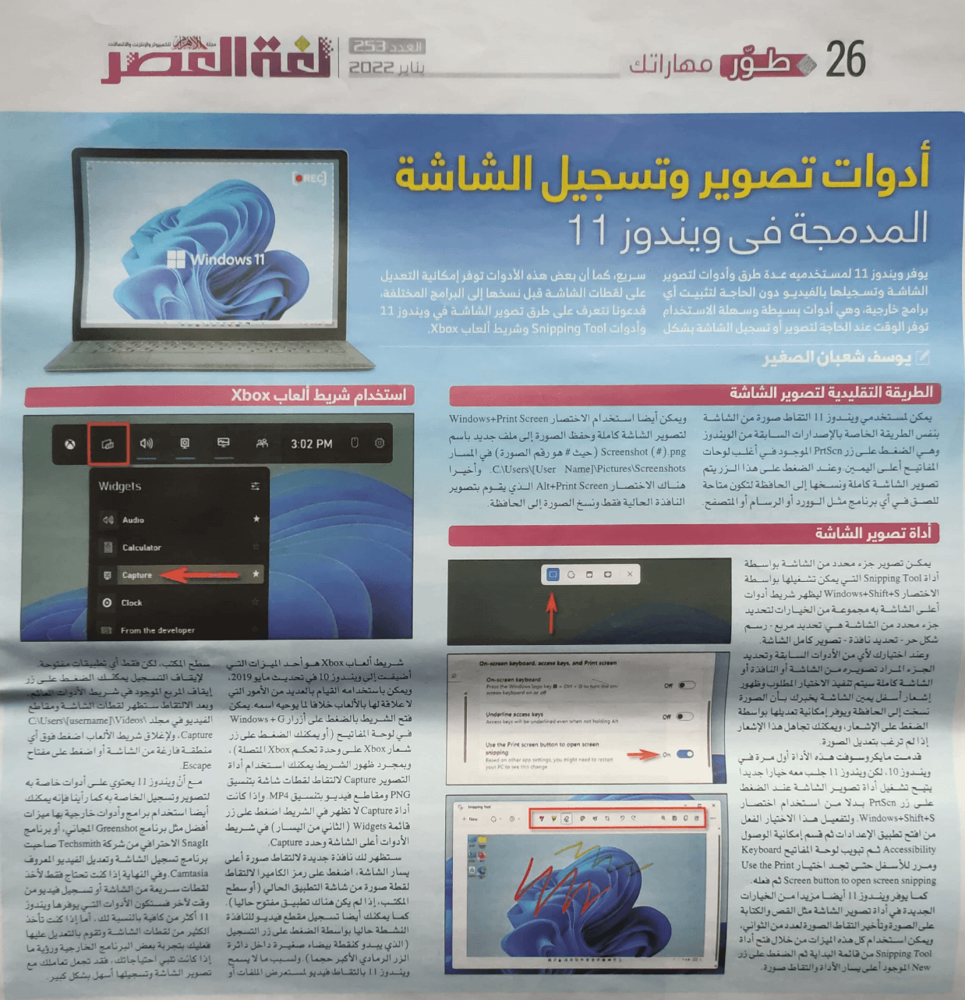

+++
title = "كيفية استخدام أدوات تصوير وتسجيل الشاشة المدمجة بويندوز 11"
date = "2022-01-01"
description = "يوفر ويندوز 11 لمستخدميه عدة طرق وأدوات لتصوير الشاشة وتسجيلها بالفيديو دون الحاجة لتثبيت أي برامج خارجية، وهي أدوات بسيطة وسهلة الاستخدام توفر الوقت عند الحاجة لتصوير أو تسجيل الشاشة بشكل سريع، كما أن بعض هذه الأدوات توفر إمكانية التعديل على لقطات الشاشة قبل نسخها إلى البرامج المختلفة، فدعونا نتعرف على طرق تصوير الشاشة في ويندوز 11 وأدوات Snipping Tool وشريط ألعاب Xbox."
categories = ["ويندوز", "مهارات رقمية",]
tags = ["مجلة لغة العصر"]
images = ["images/windows-AigsWJmvoEo-unsplash.webp"]

+++

يوفر ويندوز 11 لمستخدميه عدة طرق وأدوات لتصوير الشاشة وتسجيلها بالفيديو دون الحاجة لتثبيت أي برامج خارجية، وهي أدوات بسيطة وسهلة الاستخدام توفر الوقت عند الحاجة لتصوير أو تسجيل الشاشة بشكل سريع، كما أن بعض هذه الأدوات توفر إمكانية التعديل على لقطات الشاشة قبل نسخها إلى البرامج المختلفة، فدعونا نتعرف على طرق تصوير الشاشة في ويندوز 11 وأدوات Snipping Tool وشريط ألعاب Xbox.

|            |
| -----------------------------------------------------------: |
| الصورة بواسطة [Windows](https://unsplash.com/@windows?utm_source=unsplash&utm_medium=referral&utm_content=creditCopyText) من موقع [Unsplash](https://unsplash.com/s/photos/windows-11?utm_source=unsplash&utm_medium=referral&utm_content=creditCopyText). |

# الطريقة التقليدية لتصوير الشاشة

يمكن لمستخدمي ويندوز 11 التقاط صورة من الشاشة بنفس الطريقة الخاصة بالإصدارات السابقة من الويندوز وهي الضغط على زر PrtScn الموجود في أغلب لوحات المفاتيح أعلى اليمين. وعند الضغط على هذا الزر يتم تصوير الشاشة كاملة ونسخها إلى الحافظة لتكون متاحة للصق في أي برنامج مثل الوورد أو الرسام أو المتصفح.

ويمكن أيضًا استخدام الاختصار Windows+Print Screen لتصوير الشاشة كاملة وحفظ الصورة إلى ملف جديد باسم Screenshot (#).png (حيث # هو رقم الصورة) في المسار `C:\Users\[User Name]\Pictures\Screenshots`. وأخيرًا هناك الاختصار Alt+Print Screen الذي يقوم بتصوير النافذة الحالية فقط ونسخ الصورة إلى الحافظة.

 

# أداة تصوير الشاشة

يمكن تصوير جزء محدد من الشاشة بواسطة أداة Snipping Tool التي يمكن تشغيلها بواسطة الاختصار Windows+Shift+S ليظهر شريط أدوات أعلى الشاشة به مجموعة من الخيارات لتحديد جزء محدد من الشاشة هي: تحديد مربع - رسم شكل حر - تحديد نافذة - تصوير كامل الشاشة.

وعند اختيارك لأي من الأدوات السابقة وتحديد الجزء المراد تصويره من الشاشة أو النافذة أو الشاشة كاملة سيتم تنفيذ الاختيار المطلوب وظهور إشعار أسفل يمين الشاشة يخبرك بأن الصورة نسخت إلى الحافظة ويوفر إمكانية تعديلها بواسطة الضغط على الإشعار، ويمكنك تجاهل هذا الإشعار إذا لم ترغب بتعديل الصورة.

قدمت مايكروسوفت هذه الأداة أول مرة في ويندوز 10، لكن ويندوز 11 جلب معه خيار جديد يتيح تشغيل أداة تصوير الشاشة عند الضغط على زر PrtScn بدلا من استخدام اختصار Windows+Shift+S. ولتفعيل هذا الاختيار الفعل من افتح تطبيق الإعدادات ثم قسم إمكانية الوصول Accessibility ثم تبويب لوحة المفاتيح Keyboard ومرر للأسفل حتى تجد اختيار Use the Print Screen button to open screen snipping ثم فعله.

كما يوفر ويندوز 11 أيضًا مزيدًا من الخيارات الجديدة في أداة تصوير الشاشة مثل القص والكتابة على الصورة وتأخير التقاط الصورة لعدد من الثواني، ويمكن استخدام كل هذه الميزات من خلال فتح أداة Snipping Tool من قائمة البداية ثم الضغط على زر New الموجود أعلى يسار الأداة والتقاط صورة.

# استخدام شريط ألعاب Xbox

شريط ألعاب Xbox هو أحد الميزات التي أضيفت إلى ويندوز 10 في تحديث مايو 2019، ويمكن باستخدامه القيام بالعديد من الأمور التي لا علاقة لها بالألعاب خلافًا لما يوحيه اسمه. يمكن فتح الشريط بالضغط على أزرار Windows + G في لوحة المفاتيح (أو يمكنك الضغط على زر شعار Xbox على وحدة تحكم Xbox المتصلة)، وبمجرد ظهور الشريط يمكنك استخدام أداة التصوير Capture لالتقاط لقطات شاشة بتنسيق PNG ومقاطع فيديو بتنسيق MP4. وإذا كانت أداة Capture لا تظهر في الشريط اضغط على زر قائمة Widgets (الثاني من اليسار) في شريط الأدوات أعلى الشاشة وحدد Capture. 

ستظهر لك نافذة جديدة لالتقاط صورة أعلى يسار الشاشة، اضغط على رمز الكاميرا لالتقاط لقطة صورة من شاشة التطبيق الحالي (أو سطح المكتب، إذا لم يكن هناك تطبيق مفتوح حاليا). كما يمكنك أيضًا تسجيل مقطع فيديو للنافذة النشطة حاليًا بواسطة الضغط على زر التسجيل (الذي يبدو كنقطة بيضاء صغيرة داخل دائرة الزر الرمادي الأكبر حجمًا). ولسبب ما لا يسمح ويندوز 11 بالتقاط فيديو لـمستعرض الملفات أو سطح المكتب، لكن فقط أي تطبيقات مفتوحة.

لإيقاف التسجيل يمكنك الضغط على زر إيقاف المربع الموجود في شريط الأدوات العائم، وبعد الالتقاط ستظهر لقطات الشاشة ومقاطع الفيديو في مجلد `C:\Users\[username]\Videos\Capture`، ولإغلاق شريط الألعاب اضغط فوق أي منطقة فارغة من الشاشة أو اضغط على مفتاح Escape.

مع أنّ ويندوز 11 يحتوي على أدوات خاصة به لتصوير وتسجيل الخاصة به كما رأينا فإنه يمكنك أيضًا استخدام برامج وأدوات خارجية بها ميزات أفضل مثل برنامج Greenshot المجاني، أو برنامج SnagIt الاحترافي من شركة Techsmith مطورة برنامج تسجيل الشاشة وتعديل الفيديو المعروف Camtasia. وفي النهاية إذا كنت تحتاج فقط لأخذ لقطات سريعة من الشاشة أو تسجيل فيديو من وقت لآخر فستكون الأدوات التي يوفرها ويندوز 11 أكثر من كافية بالنسبة لك، أما إذا كنت تأخذ الكثير من لقطات الشاشة وتقوم بالتعديل عليها فعليك بتجربة بعض البرنامج الخارجية ورؤية ما إذا كانت تلبي احتياجاتك، فقد تجعل تعاملك مع تصوير الشاشة وتسجيلها أسهل بشكل كبير.

---

هذا الموضوع نُشر باﻷصل في مجلة لغة العصر العدد 253 شهر 01-2022 ويمكن الإطلاع عليه [هنا](https://drive.google.com/file/d/1sG1Z8Uukgy41SQ1QoiFK27BM7iXO25MS/view?usp=sharing).

