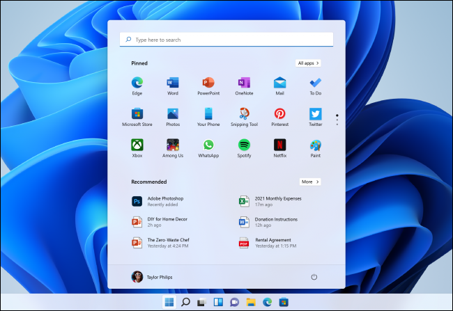
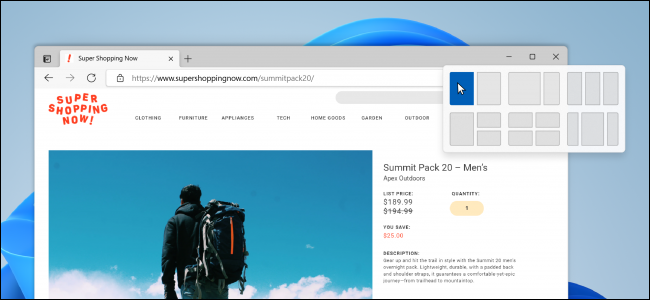
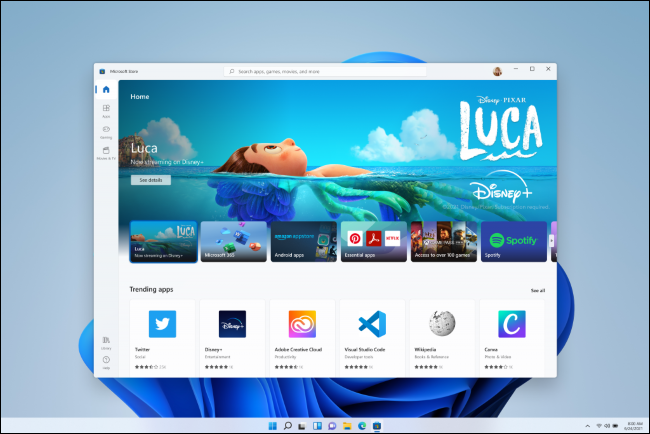
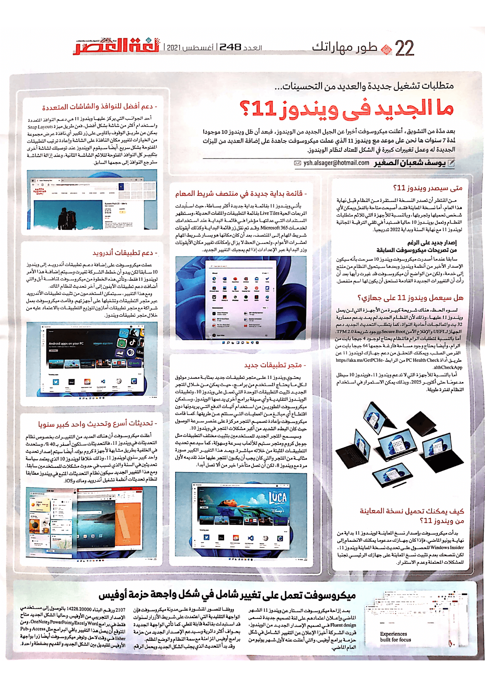

+++
title = "ما الجديد في ويندوز 11؟"
date = "2021-08-01"
description = "بعد مدّة من التشويق، أعلنت مايكروسوفت أخيرًا عن الجيل الجديد من الويندوز. فبعد أن ظل ويندوز 10 موجودا لمدة 7 سنوات ها نحن على موعد مع ويندوز 11 الذي عملت مايكروسوفت جاهدة على إضافة العديد من الميزات الجديدة له وعمل تغييرات كبيرة في الشكل المعتاد لنظام الويندوز."
categories = ["ويندوز",]
tags = ["مجلة لغة العصر"]

+++

بعد مدّة من التشويق، أعلنت مايكروسوفت أخيرًا عن الجيل الجديد من الويندوز. فبعد أن ظل ويندوز 10 موجودا لمدة 7 سنوات ها نحن على موعد مع ويندوز 11 الذي عملت مايكروسوفت جاهدة على إضافة العديد من الميزات الجديدة له وعمل تغييرات كبيرة في الشكل المعتاد لنظام الويندوز.

## متى سيصدر ويندوز 11؟

من المنتظر أن تصدر النسخة المستقرة من النظام قبل نهاية هذا العام. أما نسخة المعاينة فقد أصبحت متاحة بالفعل ويمكن لأي شخص تحميلها وتجربتها. وبالنسبة للأجهزة التي تلائم متطلبات النظام وتعمل بويندوز 10 حاليا فستبدأ في تلقي الترقية المجانية لويندوز 11 مع نهاية السنة وبداية 2022 تدريجيا.

## إصدار جديد على الرغم من تصريحات مايكروسوفت السابقة

سابقا عندما أصدرت مايكروسوفت ويندوز 10 صرحت بأنه سيكون الإصدار الأخير من أنظمة ويندوز وبعدها سيتحول النظام من منتج إلى خدمة. ولكن من الواضح أن مايكروسوفت قد غيرت رأيها بعد أن رأت أن التغييرات الجديدة القادمة تستحق أن يكون لها اسم منفصل.

## هل سيعمل ويندوز 11 على جهازي؟

لسوء الحظ، هناك شريحة كبيرة من الأجهزة التي لن يعمل ويندوز 11 عليها وذلك لأن النظام الجديد لم يعد يدعم معمارية 32 بت والمعالجات أحادية النواة، كما يتطلب التحديث الجديد دعم الجهاز ل UEFI والإقلاع الآمن Secure Boot ووجود شريحة TPM 2.0. أما بالنسبة لمتطلبات الرام فالنظام يحتاج لوجود 4 جيجا بايت من الرام، وأيضا يحتاج وجود مساحة فارغة حجمها 64 جيجا بايت من القرص الصلب. ويمكنك التحقق من دعم جهازك لويندوز 11 عن طريق أداة PC Health Check من الرابط https://aka.ms/GetPCHealthCheckApp.

أما بالنسبة للأجهزة التي لا تدعم ويندوز 11، فويندوز 10 سيظل مدعومًا حتى أكتوبر 2025، وبذلك يمكن الاستمرار في استخدام النظام لفترة طويلة.

## كيف يمكنك تحميل نسخة المعاينة من ويندوز 11؟

بدأت مايكروسوفت بإصدار نسخ المعاينة لويندوز 11 بداية من نهاية يونيو الماضي، فإذا كان جهازك مدعوما يمكنك الانضمام إلى Windows Insider للحصول على تحديث نسخة المعاينة ويندوز 11. لكن ننصحك بعدم تثبيت نسخ المعاينة على جهازك الرئيسي تجنبًا للمشاكل المحتملة وعدم الاستقرار.

## ما الجديد في ويندوز 11؟

### قائمة بداية جديدة في منتصف شريط المهام

يأتي ويندوز 11 بقائمة بداية جديدة أكثر بساطة، حيث استُبدلت المربعات الحية Live Tiles بقائمة التطبيقات والملفات الحديثة. وستظهر المستندات التي عدلتها مؤخرًا في قائمة البداية عند استخدامك لخدمات Microsoft 365. وقد تم نقل زر قائمة البداية وكذلك أيقونات شريط المهام إلى المنتصف، بعد أن كان مكانها هو يسار شريط المهام لعشرات الأعوام، ولحسن الحظ لا يزال بإمكانك تغيير مكان الأيقونات وزر البداية عبر الإعدادات إذا لم يعجبك التغيير الجديد.

### دعم أفضل للنوافذ والشاشات المتعددة

أحد الجوانب التي يركز عليها ويندوز 11 هي دعم النوافذ المتعددة واستخدام أكثر من شاشة بشكل أفضل. فعن طريق ميزة Snap Layouts يمكن عن طريق الوقوف بالماوس على زر تكبير أي نافذة عرض مجموعة من الخيارات لتغيير مكان النافذة على الشاشة وإعادة ترتيب التطبيقات المفتوحة بشكل سريع. أيضًا سيقوم الويندوز عند توصيلك لشاشة أخرى بتكبير كل النوافذ المفتوحة لتلائم الشاشة الثانية، وعند إزالة الشاشة سترجع النوافذ إلى حجمها السابق.

### تحديثات أسرع، وتحديث واحد كبير سنويًا

أعلنت مايكروسوفت أن هناك العديد من التغييرات بخصوص نظام التحديثات في ويندوز 11، فالتحديثات ستكون أصغر ب40%، وستحدث في الخلفية بطريق مشابهة لأجهزة كروم بوك. أيضًا سيتم إصدار تحديث واحد كبير سنوي لويندوز 11 وذلك خلافًا لويندوز 10 التي يعتمد سياسة تحديثين في السنة والذي تسبب في حدوث مشكلات للمستخدمين سابقًا. ومع هذا التغيير الجديد سيكون نظام التحديثات المتبع في ويندوز مطابقًا لنظام تحديثات أنظمة تشغيل أندرويد وماك وiOS.

### متجر تطبيقات جديد

يحتوي ويندوز 11 على متجر تطبيقات جديد بمثابة مصدر موثوق لكل ما يحتاج المستخدم من برامج. حيث يمكن من خلال المتجر الجديد تثبيت التطبيقات الموحدة التي تعمل على ويندوز 10، وتطبيقات الويندوز التقليدية وأي صيغة برامج أخرى يدعمها الويندوز. وستمكن مايكروسوفت المطورين استخدام أليات الدفع التي يريدونها دون اقتطاع أي مبالغ من العمليات التي ستتم عن طريقها. كما قامت مايكروسوفت بإعادة تصميم المتجر مركزة على عنصر سرعة الوصول حيث كان البطء الشديد من أكبر مشاكل المتجر في ويندوز 10.

وسيسمح المتجر الجديد للمستخدمين بتثبيت مختلف التطبيقات مثل جوجل كروم ومتجر ستيم للألعاب بسرعة وسهولة، كما سيدعم تحديث التطبيقات المثبتة من خلاله مباشرة. ويعد هذا التغيير الكبير صورة مثالية من المتجر والتي كان يجب أن يكون المتجر عليها منذ تقديمه لأول مرة مع ويندوز 8، لكن أن تصل متأخرًا خير من ألا تصل أبدًا.

### دعم تطبيقات أندرويد

عملت مايكروسوفت على إضافة دعم تطبيقات أندرويد إلى ويندوز 10 سابقًا لكن يبدو أن خطط الشركة تغيرت وسيتم إضافة هذا الأمر لويندوز 11 فقط. وتأتي هذه الخطوة من مايكروسوفت لمنافسة أبل والتي أضافت دعم تطبيقات الأيفون إلى آخر تحديث لنظام الماك.

ومع هذا التغيير، سيتمكن المستخدمين من تثبيت تطبيقات الأندرويد عبر متجر التطبيقات وتشغيلها على أجهزتهم. وقامت مايكروسوفت بعمل شراكة مع متجر تطبيقات أمازون لتوزيع التطبيقات بالاعتماد عليه من خلال متجر تطبيقات ويندوز.

---

هذا الموضوع نُشر باﻷصل في مجلة لغة العصر العدد 248 شهر 08-2021 ويمكن الإطلاع عليه [هنا](https://drive.google.com/file/d/1AG4qLL_v4pSmkmJfCoh5ZSyP9zYyN96s/view?usp=sharing).

