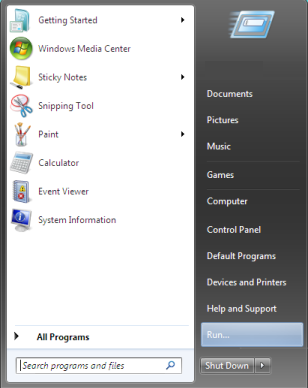
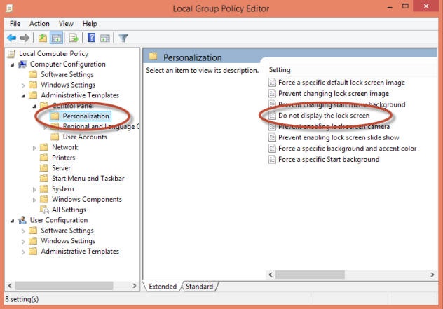
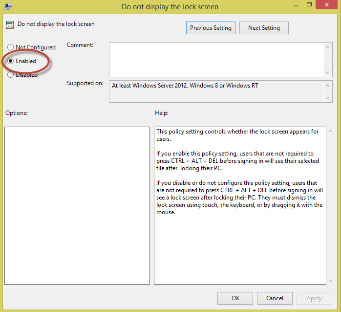

+++
title = "طريقة تعطيل شاشة القفل في ويندوز 8"
date = "2015-05-16"
description = "هل لديك ويندوز 8.1 ولا تحب إضافة شاشة القفل، إليك طريقة تعطيل شاشة القفل في ويندوز 8/8.1 بدون استخدام أي برامج."
categories = ["ويندوز",]
tags = ["موقع لغة العصر"]
images = ["images/2015-635673944745333670-533.png"]

+++

هل لديك ويندوز 8.1 ولا تحب إضافة شاشة القفل، إليك طريقة تعطيل شاشة القفل في ويندوز 8/8.1 بدون استخدام أي برامج.
1. قم بالضغط على Windows+ R أو فتح مربع RUN من داخل قائمة البداية Start Menu.

2. قم بكتابة gpedit.msc ثم اضغط Enter.
3. ستفتح نافذة Group Policy Editor.

4. من القائمة الجانبية قم بالتوجه إلى computer configuration > Window setting > administrative templates > personalization.
5. من الناحية اليمنى قم بالضغط بزر الفأرة الأيسر مرتين على Do Not Display Lock screen.
6. قم بتفعيل القيمة Enabled ثم اضغط OK.

**ملاحظة**: لإعادة تفعيل شاشة القفل قم بتطبيق نفس الخطوات السابقة ثم قم بتفعيل القيمة **Not configured**.

---
هذا الموضوع نٌشر باﻷصل على موقع مجلة لغة العصر.