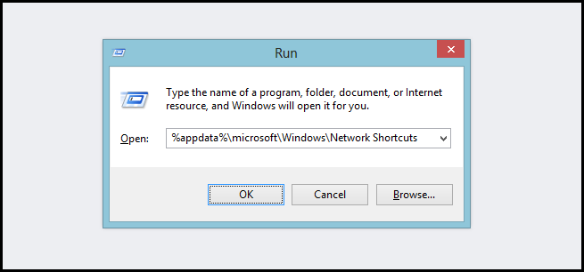
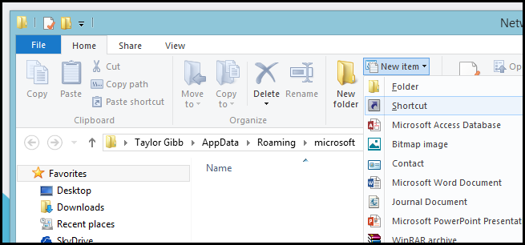
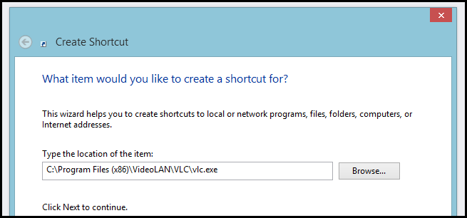
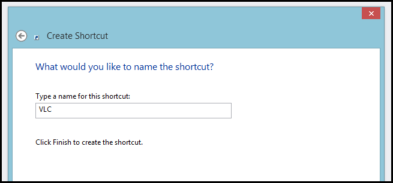
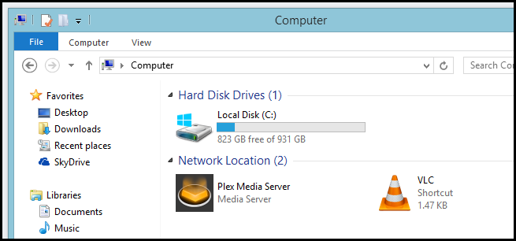

+++
title = "طريقة إضافة اختصارات البرامج والمجلدات إلى My Computer"
date = "2015-04-07"
description = "الاختصارات في نظام الويندوز هي من أكثر الأشياء التي يمكن تخصيصها بلا حدود، نقدم لك عزيزي القارئ طريقة لتوفير الوقت عن طريق إضافة اختصارات برامجك المفضلة إلى My Computer."
categories = ["ويندوز",]
tags = ["موقع لغة العصر"]
images = ["images/2015-635640276173440964-344.png"]

+++

الاختصارات في نظام الويندوز هي من أكثر الأشياء التي يمكن تخصيصها بلا حدود، نقدم لك عزيزي القارئ طريقة لتوفير الوقت عن طريق إضافة اختصارات برامجك المفضلة إلى My Computer.

1. قم بفتح مربع Run عن طريق قائمة البداية أو الضغط على Windows+R.
2. قم بكتابة الأمر التالي ثم اضغط Enter:
%appdata%\microsoft\Windows\Network Shortcuts

3. ستُفتح لك نافذة جديدة يمكنك لصق الاختصار الذي تريد بداخله "Paste Shortcut"، أو يمكنك إضافة اختصار جديد عن طريق الضغط بزر الفأرة الأيمن ثم اختيار New Shortcut من قائمة New.

4. بمجرد أن يفتح المعالج قم بالضغط على Browse ثم قم باختيار ما تريد اضافته، أو قم بكتابه المسار الخاص بالمجلد أو الملف.

5. قم بكتابه اسم الاختصار ثم اضغط Finish.

6. ستجد الاختصار قد ظهر ب My computer كما بالصورة.

---
هذا الموضوع نٌشر باﻷصل على موقع مجلة لغة العصر.

http://aitmag.ahram.org.eg/News/9126.aspx