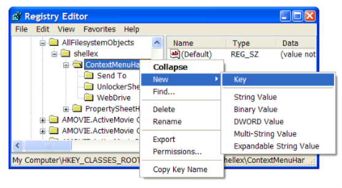
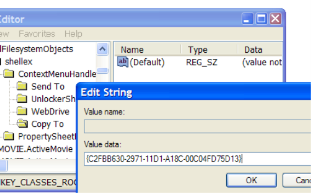
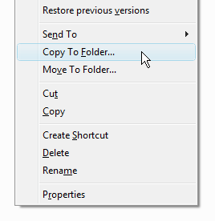
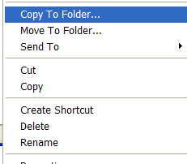
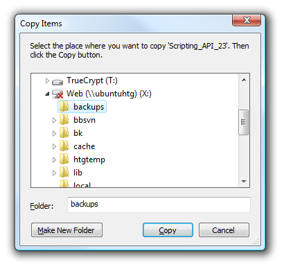
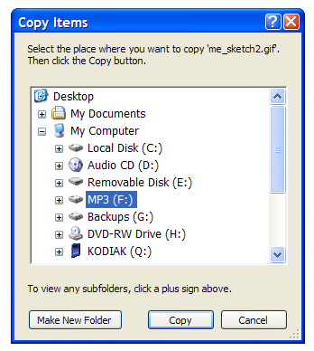

+++
title = "طريقة إضافة خيارات Copy To / Move To إلى القائمة المختصرة في الويندوز"
date = "2015-04-14"
description = "نظام الويندوز كالمحيط العميق الذي كلما تعمقت فيه أكثر اكتشفت أسراره وخفاياه، نقدم لك عزيزي القارئ سرا جديدا من اسرار الويندوز هو كيفية إضافة ميزتي النسخ والقص الى مجلد محدد الى قائمة الزر الأيمن في ويندوز"
categories = ["مهارات رقمية",]
tags = ["موقع لغة العصر"]

+++

نظام الويندوز كالمحيط العميق الذي كلما تعمقت فيه أكثر اكتشفت أسراره وخفاياه، نقدم لك عزيزي القارئ سرا جديدا من اسرار الويندوز هو كيفية إضافة ميزتي "النسخ والقص الى مجلد محدد" الى قائمة الزر الأيمن في ويندوز.

تعتمد هذه الحيلة على تعديل ملفات الريجيسترى الخاصة بالويندوز، كما أنها تعمل على كل إصدارات الويندوز.

## الطريقة اليدوية:

1. قم بفتح محرر الريجيسترى عن طريق RUN (Windows+R) ثم انتقل الى هذا المفتاح

HKEY\_CLASSES\_ROOT\AllFilesystemObjects\shellex\ContextMenuHandlers

2. قم بالضغط على هذا المجلد، من قائمة New اختر Key.

3. اضغط مرتين على (Default) ثم ادخل القيمة الآتية:

{C2FBB630.2971.11D1.A18C-00C04FD75D13}

4. اضغط موافق (تمت إضافة خيار Copy to).

5. قم بعمل New Key مرة أخرى ثم قم بإدخال هذه القيمة:

{C2FBB631.2971.11D1.A18C-00C04FD75D13}

6. اضغط مواقف (تمت إضافة خيار Move To).

عند الضغط بزر الفأرة الأيمن على أي ملف أو مجلد ستظهر لك الخيارات الجديدة كما بالصور:

## الطريقة الاوتوماتيكية:

قم بتحميل هذا الملف [من هنا](http://cdn5.howtogeek.com/wp-content/uploads/gg/copyto_moveto.zip)، ثم قم بفك الضغط ستجد ملفي ريجسترى، تستطيع تفعيل خيار Copy To أو Move To أو كلاهما.

---
هذا الموضوع نٌشر باﻷصل على موقع مجلة لغة العصر.

http://aitmag.ahram.org.eg/News/9729.aspx