+++
title = "كيفية تحميل جميع اصدارات ويندوز وأوفيس بروابط رسمية من مايكروسوفت"
date = "2017-02-10"
description = "كم مرة حاولت أن تقوم بتحميل نسخة ويندوز أو أوفيس وظللت تبحث لوقت طويل عن ما تريد، وفى الغالب وجدت نسخ مقرصنة والتي غالبا ما يكون مدمج بها برمجيات خبيثة من Trojan أو Malware مما يسبب العديد من المشكلات فى جهازك. لا داعي للبحث بعد الآن، فطريقة الوصول للروابط الرسمية لإصدارات مايكروسوفت أصبحت سهلة للغاية بفضل موقع TechBench."
categories = ["ويندوز",]
tags = ["افهم تكنولوجيا"]
series = ["ويندوز 10"]
images = ["images/windows_8_wallpaper_by_pavelstrobl-d6412rg.png"]
+++

كم مرة حاولت أن تقوم بتحميل نسخة ويندوز أو أوفيس وظللت تبحث لوقت طويل عن ما تريد، وفى الغالب وجدت نسخ مقرصنة والتي غالبا ما يكون مدمج بها برمجيات خبيثة من Trojan أو Malware مما يسبب العديد من المشكلات فى جهازك. لا داعي للبحث بعد الآن، فطريقة الوصول للروابط الرسمية لإصدارات مايكروسوفت أصبحت سهلة للغاية بفضل موقع TechBench.

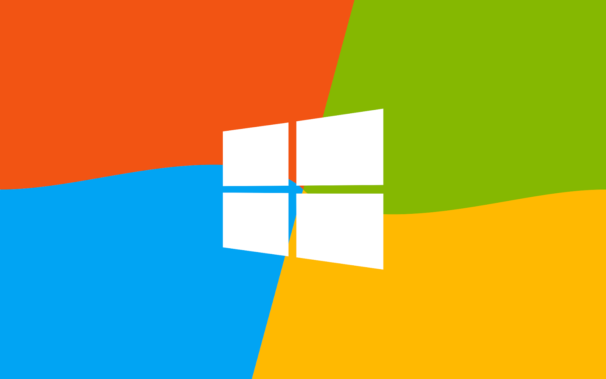

## طريقة تحميل الويندوز بروابط رسمية من مايكروسوفت

كل ما عليك هو الدخول إلى هذا الرابط:: [حمل من هنا](https://tb.rg-adguard.net/public.php)

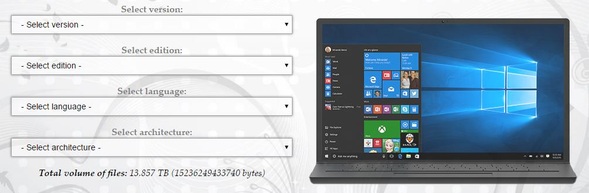

ستجد واجهة الموقع كما بالصورة، فى خانة Version ستجد جميع نسخ الويندوز والأوفيس حتى نسخ المعاينة من ويندوز 10، باستثناء أوفيس 2013 و 2016 اللذان سنتعرف على طريقة تحميلهما فى نهاية الموضوع.

- قم باختيار الإصدار الذي تريد تحميله من القائمة المنسدلة.

  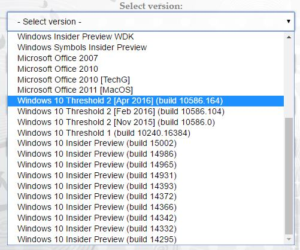

- ثم اختر نوع النسخة التى تريدها.

  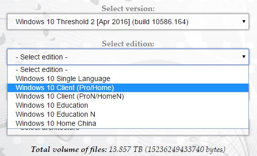

- بعد ذلك اختر اللغة التى تود استخدام الويندوز بها.

  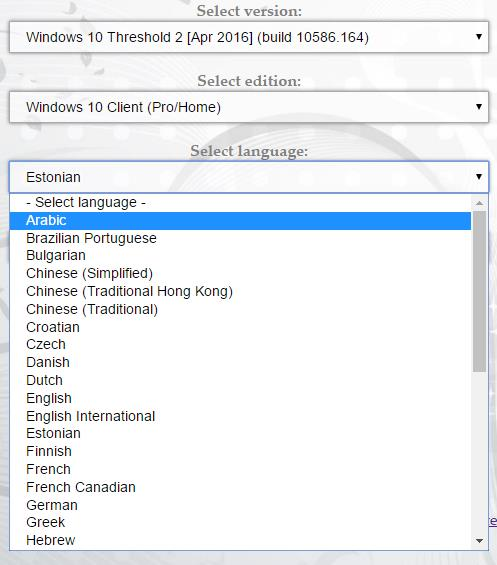

- وأخيرا قم باختيار معمارية النسخة قبل التحميل، سواء 32 بت أم 64 بت.

  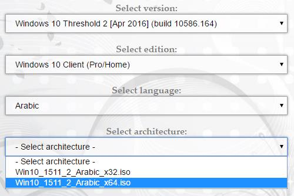

- سيظهر لك رابط التحميل كما بالصورة، اضغط على زر التحميل واستمتع!

  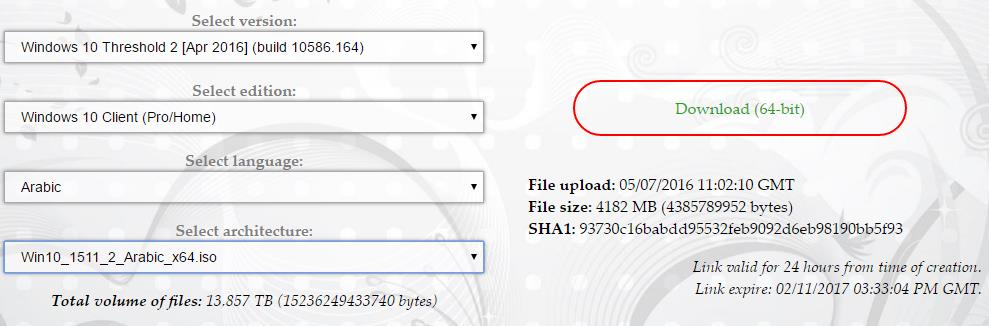

  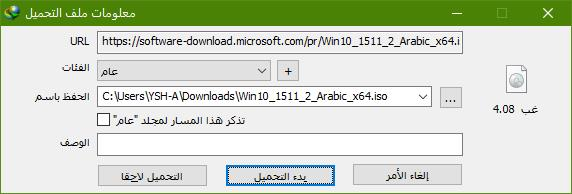

أيضا يمكنك أيضا الضغط على رابط TechBench Dump أسفل موقع التحميل والبحث فى الصفحة لإيجاد النسخة التى تريد تحميلها. 

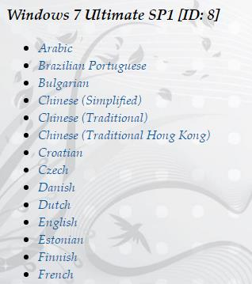

 بمجرد ضغطك على رابط اللغة التى تريد استخدامها ستنبثق صفحة جديدة بها أزرار التحميل!

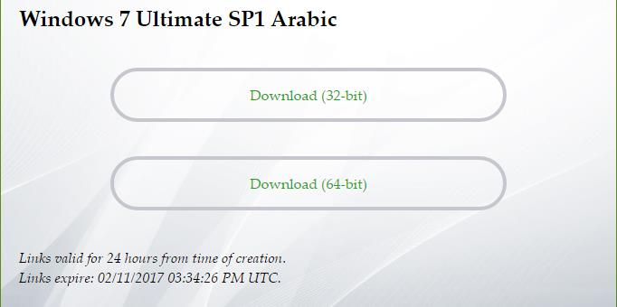

## طريقة تحميل أوفيس 2013/2016/2019/2021 بروابط رسمية من مايكروسوفت

كل ما عليك هو الدخول إلى هذه الروابط:

- [أوفيس 2013](http://bit.ly/Office2013DownloadET)
- [أوفيس 2016](http://bit.ly/Office2016DownloadET)
- [أوفيس 2019](https://www.heidoc.net/joomla/technology-science/microsoft/82-office-2019-direct-download-links)
- [أوفيس 2021](https://www.heidoc.net/joomla/technology-science/microsoft/16-office-2021-direct-download-links)

ابحث عن اللغة التى تريد استخدام الأوفيس بها

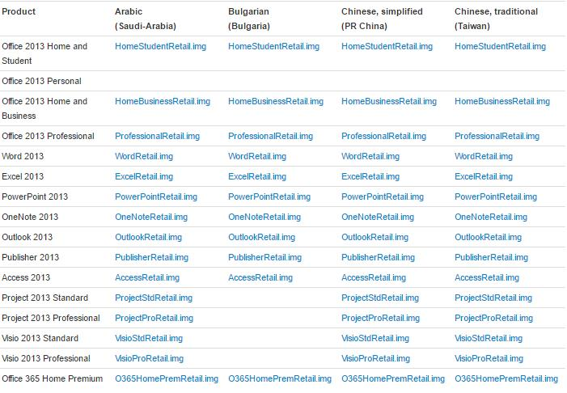

وبمجرد ضغطك على الرابط سيبدأ التحميل فورا!

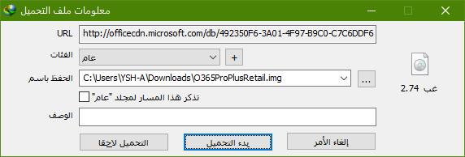

---

هذا المقال نشر باﻷصل على مدونة افهم تكنولوجيا ويمكن الإطلاع عليه [هنا](https://efhamtechnology.blogspot.com/2017/02/Windows-Office-Download-Official-Links.html).
