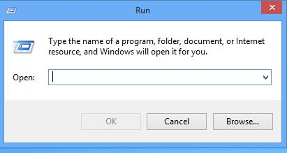
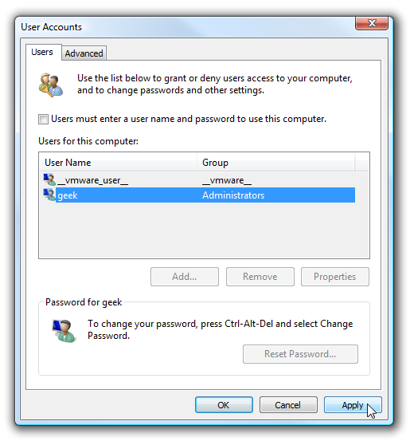
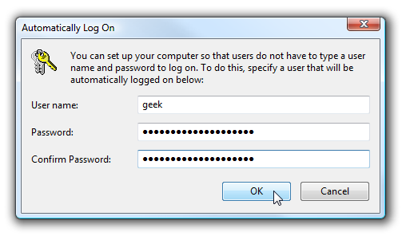

+++
title = "كيف تجعل الويندوز يقوم بتسجيل الدخول بدلا عنك؟"
date = "2015-05-26"
description = "تعمل هذه الحيلة على جميع إصدارات الويندوز بداية من XP وحتى 10"
categories = ["ويندوز",]
tags = ["موقع لغة العصر"]

+++

ملاحظة:
 يجب عليك عزيزي القارئ أن تعلم أن هذه الطريقة تقلل من أمان جهازك فيمكن 
لأي شخص في منزلك الدخول الى جهازك بدون الاحتياج الى كلمة المرور.

تعمل هذه الحيلة على جميع إصدارات الويندوز بداية من XP وحتى 10.

1. قم بفتح مربع Run عن طريق Ctrl+R.

2. قم بكتابة هذا الأمر netplwiz ثم اضغط Enter.
3. ستظهر لك هذه النافذة:

إذا لم يعمل هذا الأمر يمكنك كتابة هذا الأمر البديل userpasswords2.
4. قم بإزالة العلامة من أمام هذا الصندوق “Users must enter a user name and password to use this computer” ثم اضغط Apply.
5. سيظهر لك مربع لكتابة اسم المستخدم وكلمة المرور، قم بكتابتهما، ثم اضغط OK.

---
هذا الموضوع نٌشر باﻷصل على موقع مجلة لغة العصر.

http://aitmag.ahram.org.eg/News/16113.aspx