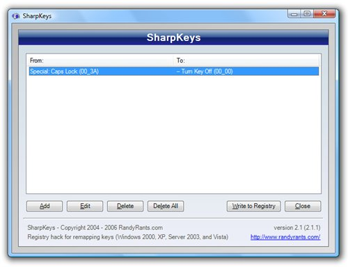
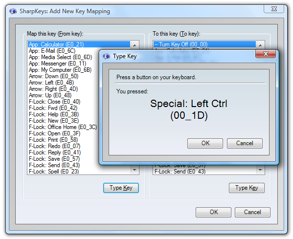
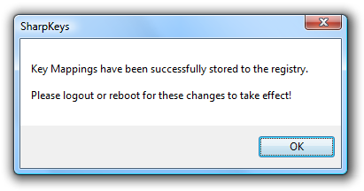
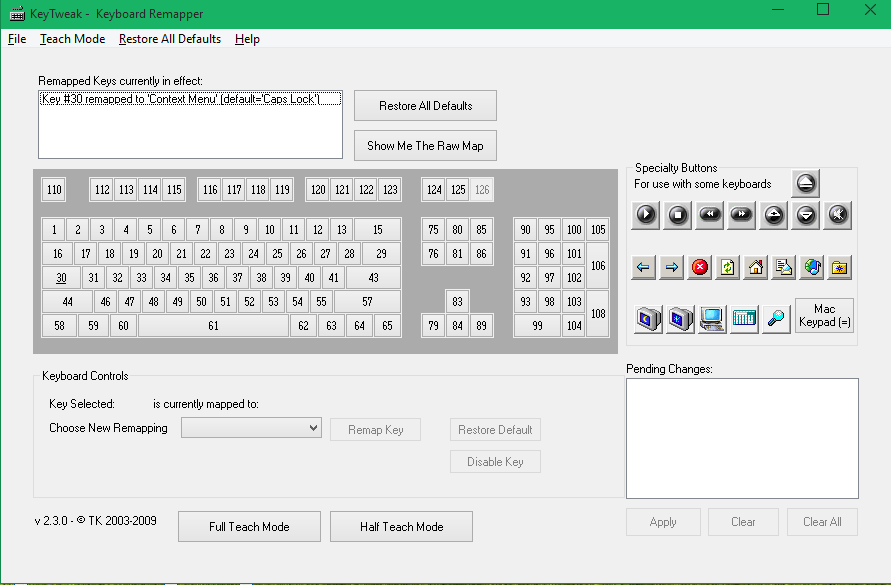
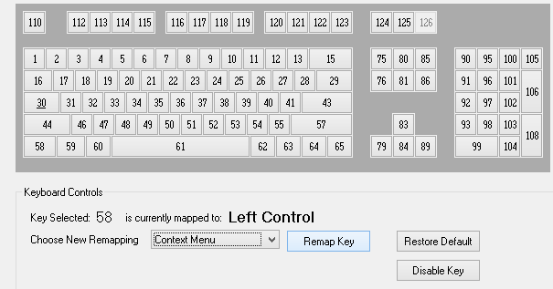

+++
title = "طريقة تغيير وظيفة أي زر في لوحة المفاتيح في الويندوز"
date = "2015-05-28"
description = "كثير منا تعرض لموقف تعطل بعض أزرار لوحة المفاتيح وتصبح المشكلة أكبر إذا كانت في حاسب محمول، فحينها تحتاج الي شراء لوحة مفاتيح جديدة، ولكن في درس اليوم نقدم لك حل بسيط لهذه المشكلة عن طريق تغيير مهمة أي زر في لوحة المفاتيح الى زر آخر"
categories = ["ويندوز",]
tags = ["موقع لغة العصر"]

+++

كثير منا تعرض لموقف تعطل بعض أزرار لوحة المفاتيح وتصبح المشكلة أكبر إذا كانت
 في حاسب محمول، فحينها تحتاج الي شراء لوحة مفاتيح جديدة، ولكن في درس 
اليوم نقدم لك حل بسيط لهذه المشكلة عن طريق تغيير مهمة أي زر في لوحة 
المفاتيح الى زر آخر.

أيضا تفيد هذه الطريقة في تعيين مهام معينة مثل عمل Refresh عن طريق الضغط على الزر الى تقوم بتعيينه، كما أنه باستخدام تلك الطريقة تستطيع تعطيل عمل أي زر، وبالتأكيد تستطيع الغاء التغييرات واستعادة لوحة المفاتيح الافتراضية، وتعمل هذه الطريقة على كل إصدارات الويندوز.

## الطريقة الأولى: باستخدام برنامج SharpKeys:

1. قم بتحميل البرنامج [من هنا](http://www.randyrants.com/2006/07/sharpkeys_211.html).
2. بعد تثبيته قم بفتحه ستظهر لك الواجهة كما بالصورة:

3. اضغط Add ثم اختر الزر الذي تريد تغييره من القائمة، أو اضغط Type Key ثم اضغط على الزر.
4. من القسم To this Key قم باختيار الزر الجديد الذي تريد تعيينه.

5. بعد أن تنتهي قم بالضغط على الزر Write to Registry لتطبيق التغييرات.
6. قم بإعادة التشغيل، أو تسجيل الخروج.

## الطريقة الثانية: باستخدام برنامج KeyTweak:

1. قم بتحميل البرنامج [من هنا](http://www.majorgeeks.com/mg/getmirror/keytweak,3.html).
2. بعد تثبيته قم بفتحه ستظهر لك الواجهة كما بالصورة:

3. قم بالضغط على الزر الذي تريد تغييره، ثم من القائمة المنسدلة Choose New Remapping اختر الزر الجديد الذي تريد تعيينه.
4. اضغط Remap Key، سيظهر لك الزر في المربع الموجود على اليمين، اضغط Apply.

5. قم بإعادة التشغيل لتطبيق التغييرات.

---
هذا الموضوع نٌشر باﻷصل على موقع مجلة لغة العصر.

http://aitmag.ahram.org.eg/News/17085.aspx