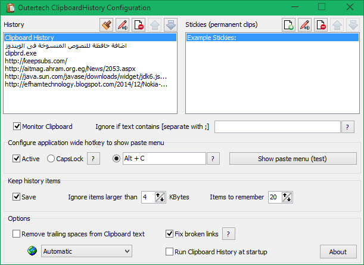
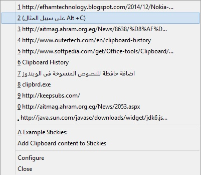

+++
title = "طريقة إضافة حافظة للنصوص المنسوخة في الويندوز"
date = "2015-04-04"
description = "من المعروف لدى محترفي الويندوز أن أقصى ما تستطيع حافظة المنسوخات المدمجة مع النظام هي تذكر كلمة واحده، ولكن إذا كنت من الأشخاص الذين يتعاملون مع النصوص كثيرا ويقومون بنسخ العديد منها، ستجد الحل في هذا الموضوع"
categories = ["ويندوز",]
tags = ["موقع لغة العصر"]
images = ["images/0.jpg"]

+++

من المعروف لدى محترفي الويندوز أن أقصى ما تستطيع حافظة المنسوخات المدمجة مع النظام هي تذكر كلمة واحده، ولكن إذا كنت من الأشخاص الذين يتعاملون مع النصوص كثيرا ويقومون بنسخ العديد منها، ستجد الحل في هذا الموضوع.

هناك عدة برامج تضيف خاصية حافظة المنسوخات Clipboard التي تقوم بحفظ عدد كبير من النصوص المنسوخة لإعادة استخدامها فيما بعد، بعض هذه البرامج يحتاج تثبيت، والبعض الآخر يعمل بدون تثبيت.

من أفضل هذه البرامج [Clipboard History](http://www.softpedia.com/get/Office-tools/<a target='_blank' href='()'>Clipboard</a>/<a target='_blank' href='()'>Clipboard</a>-History-Outer.shtml)

يمكنك تحميل النسخة المحمولة من البرنامج [من هنا](http://www.softpedia.com/get/Office-tools/<a target='_blank' href='()'>Clipboard</a>/<a target='_blank' href='()'>Clipboard</a>-History-Outer.shtml)، أو من [الموقع الرسمي](http://www.outertech.com/en/clipboard-history).

يستطيع البرنامج الاحتفاظ ب 20 نص منسوخ، كما يمكنك من إضافة نصوص ثابتة لاستخدامها لاحقا.

بعد تحميل البرنامج يمكنك اضافته إلى قائمة برامج بدء التشغيل، راجع [هذا الموضوع](()%D8%AF%D8%B1%D9%88%D8%B3/%D8%B4%D8%B1%D8%AD-%D9%88%D8%AA%D8%B9%D9%84%D9%8A%D9%85/%D8%B7%D8%B1%D9%8A%D9%82%D8%A9.%D8%A5%D8%B6%D8%A7%D9%81%D8%A9.%D8%A7%D9%84%D8%A8%D8%B1%D9%86%D8%A7%D9%85%D8%AC-%D9%84%D8%AA%D8%B9%D9%85%D9%84.%D9%85%D8%B9.%D8%A8%D8%AF%D8%A1.%D8%AA%D8%B4%D8%BA%D9%8A%D9%84.%D9%88%D9%8A%D9%86%D8%AF%D9%88%D8%B2..aspx).

يمكنك إعداد اختصار (على سيبل المثال Alt +C) إذا قمت بالضغط عليه تظهر قائمة النصوص المنسوخة كما بالصورة

إليك أيضا بعض الاقتراحات الأخرى لتجربتها:

[ClipTrap](http://skwire.dcmembers.com/fp/?page=cliptrap) (Portable)

[Save.me](http://www.aiclipboard.com/save.me/)

[Clipboardic](http://www.nirsoft.net/utils/clipboardic.html)

[Ditto](http://ditto-cp.sourceforge.net/)

[xNeat](http://www.xneat.com/clipboard-manager/)

[Shapeshifter](http://flamefusion.net/software/shapeshifter-clipboard-manager)

[Clipboard Magic](http://www.cybermatrix.com./clipboard-magic.html#screen)

---
هذا الموضوع نٌشر باﻷصل على موقع مجلة لغة العصر.

http://aitmag.ahram.org.eg/News/8848.aspx