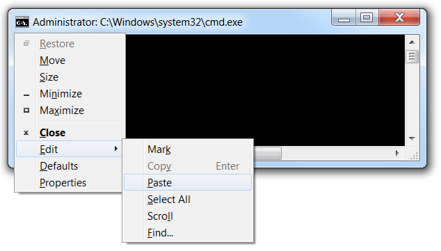

+++
title = "طريقة استخدام اختصار اللصق داخل موجه الأوامر"
date = "2015-02-01"
description = "من أكبر المشكلات التي تضايق المبرمجين ومستخدمي موجه الأوامر command prompt في نظام ويندوز عدم عمل اختصار للصق الملفات Ctrl+V داخل الموجه، نقدم لك عزيزي القارئ طريقة استخدام هذا الاختصار."
categories = ["مهارات رقمية",]
tags = ["موقع لغة العصر"]
images = ["images/2015-635583951966912457-691.png"]

+++

من أكبر المشكلات التي تضايق المبرمجين ومستخدمي موجه الأوامر command prompt في نظام ويندوز عدم عمل اختصار للصق الملفات Ctrl+V داخل الموجه، نقدم لك عزيزي القارئ طريقة استخدام هذا الاختصار.

يمكن موجه الأوامر command prompt من لصق النصوص عن طريقة الضغط بزر الفأرة الأيمن على شريط العنوان ثم اختيار Edit ثم Paste.

أو باستخدام لوحة المفاتيح عن طريق الضغط على Alt+Space ثم الحرف E ثم الحرف P.

ولكن لا يمكن استخدام اختصار لصق الملفات Ctrl+V بالطريقة العادية، ولتفعيل هذا الاختصار اتبع الخطوات التالية:

أولا: ستقوم بتحميل برنامج AutoHotkey من [الموقع الرسمي](http://www.autohotkey.com/).

ثانيا: قم بتثبيت البرنامج ولا تقم بفتحه.

ثالثا: قم بتحميل هذا الاسكريت [من هنا](http://cdn5.howtogeek.com/wp-content/uploads/gg/up/PasteCommandPrompt.ahk).

استمتع الأن باللصق داخل موجه الأوامر بحرية.

لا تنس إغلاق برنامج AutoHotkey من الأيقونة الخاصة به بجوار الساعة بعد إغلاق موجه الأوامر.

---
هذا الموضوع نٌشر باﻷصل على موقع مجلة لغة العصر.

http://aitmag.ahram.org.eg/News/4844.aspx