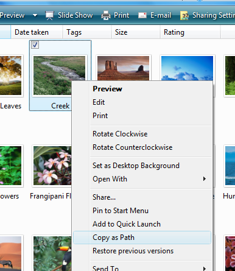
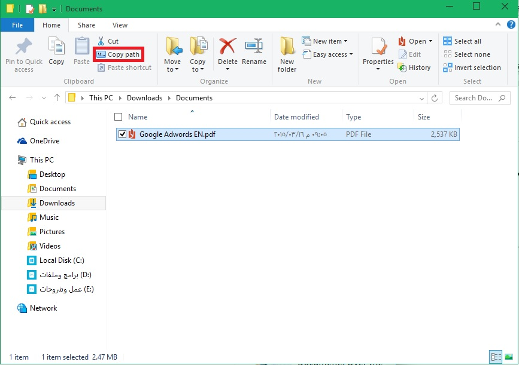

+++
title = "حيلة بسيطة لنسخ الملفات كمسار في الويندوز"
date = "2015-05-24"
description = "كم مرة دخلت عزيزي القارئ على خصائص الملف، لتستطيع الحصول على مسار ملف لتستخدمه في موجه الأوامر أو أي برنامج آخر. هل تعلم أنه يمكنك نسخ مسار الملف عن طريق قائمة زر الفأرة الأيمن. إليكم الطريقة."
categories = ["ويندوز",]
tags = ["موقع لغة العصر"]

+++

كم مرة دخلت عزيزي القارئ على خصائص الملف، لتستطيع الحصول على مسار ملف لتستخدمه في موجه الأوامر أو أي برنامج آخر. هل تعلم أنه يمكنك نسخ مسار الملف عن طريق قائمة زر الفأرة الأيمن. إليكم الطريقة.

**الطريقة الأولى:**
قم بالضغط المطول على زر Shift ثم قم بالضغط على الملف الذي تريد نسخ مساره بزر الفأرة الأيمن.

ستظهر القائمة كما بالصورة:

قم بالضغط على Copy as Path.

قم لصق المسار في أي مكان تريد سيظهر لك كما يلي:

“C:\Users\Public\Pictures\Sample Pictures\Pic.jpg”

**الطريقة الثانية:**

تعمل هذه الطريقة مع ويندوز 8/8.1/10 فقط.

قم بتحديد الملف الذي تريد نسخ مساره.

ستجد اختيار Copy Path كما بالصورة:

قم بالضغط عليه، ثم انسخ المسار في أي مكان تريد.

---
هذا الموضوع نٌشر باﻷصل على موقع مجلة لغة العصر.

http://aitmag.ahram.org.eg/News/15976.aspx