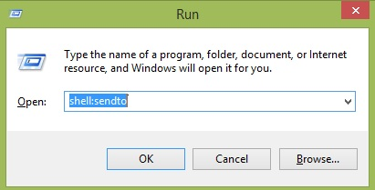
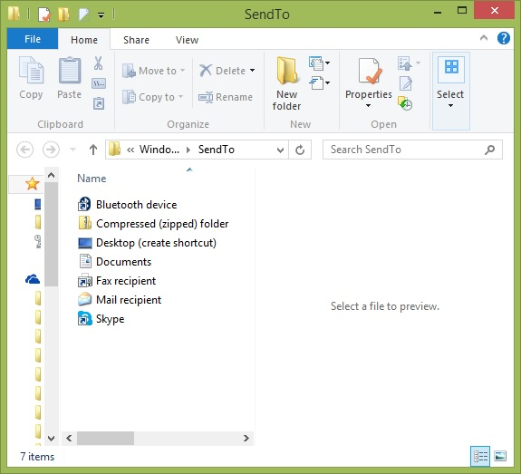
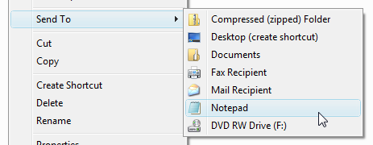

+++
title = "طريقة تخصيص قائمة Send to في الويندوز"
date = "2015-06-20"
description = "من ضمن الأشياء التي يمكن تخصيصها في نظام الويندوز قائمة Send To فيمكنك إضافة أماكن مجلدات لنسخ الملفات إليها، أو حتى برامج لتشغيل الملفات عن طريقها، اليك طريقة التعديل عليها وإضافة المزيد من الخيارات."
categories = ["ويندوز",]
tags = ["موقع لغة العصر"]

+++

من ضمن الأشياء التي يمكن تخصيصها في نظام الويندوز قائمة Send To فيمكنك إضافة أماكن مجلدات لنسخ الملفات إليها، أو حتى برامج لتشغيل الملفات عن طريقها، اليك طريقة التعديل عليها وإضافة المزيد من الخيارات.

1. قم بفتح مربع Run عن طريق الضغط على Windows+R ثم قم بكتابة Shell:Sendto.

2. ستظهر لك قائمة Send To على شكل مجلد كما بالصورة:

3. قم بإضافة المجلدات أو البرامج التي تريد اضافاتها عن طريق نسخها ثم لقصها كاختصار Paste Shortcut.
4. بعد إضافة ما تريد تحقق من التغييرات عن طريق الضغط بزر الفأرة الأيمن على أي ملف والدخول الى قائمة Send To.

---
هذا الموضوع نٌشر باﻷصل على موقع مجلة لغة العصر.

http://aitmag.ahram.org.eg/News/17617.aspx