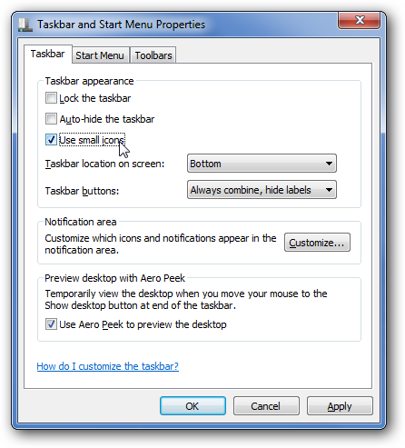
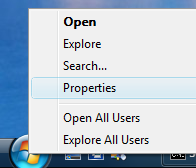
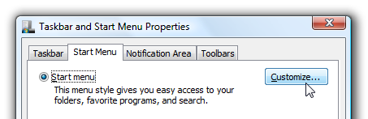
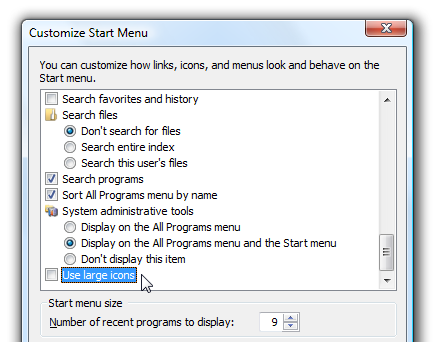
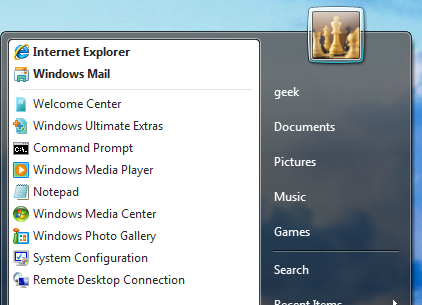

+++
title = "للمبتدئين.. طريقة التحكم في حجم أيقونات قائمة البداية"
date = "2015-05-25"
description = "يقوم نظام الويندوز افتراضيا باستخدام أزرار قائمة البداية بالحجم الكبير، ومما يجعل الجهاز بطيء هو كثرة عدد التطبيقات في قائمة البداية، ولكن حيلة اليوم تتغلب على هذه المشكلة بتصغير حجم الأيقونات، إليكم الطريقة"
categories = ["ويندوز",]
tags = ["موقع لغة العصر"]
images = ["images/0.jpg"]

+++

يقوم نظام الويندوز افتراضيا باستخدام أزرار قائمة البداية بالحجم الكبير، ومما يجعل الجهاز بطيئا هو كثرة عدد التطبيقات في قائمة البداية، ولكن حيلة اليوم تتغلب على هذه المشكلة بتصغير حجم الأيقونات.. إليكم الطريقة.

**طريقة تغيير حجم أيقونات قائمة البداية في ويندوز 7:** 

1. قم بالضغط بزر الفأرة الأيمن على زر قائمة البداية، ثم اختر Properties. 

2. قم بوضع العلامة على الصندوق Use Small Icons.

**طريقة تغيير حجم أيقونات قائمة البداية في ويندوز XP/Vista:** 

1. قم بالضغط بزر الفأرة الأيمن على زر قائمة البداية، ثم اختر Properties. 

2. اضغط على التبويب Customize. 

3. ستجد أخر الصفحة الاختيار Use large icons قم بإزالة العلامة من عليه. 

ستجد قائمة البداية قد أصبحت كما بالصورة: 

---
هذا الموضوع نٌشر باﻷصل على موقع مجلة لغة العصر.

http://aitmag.ahram.org.eg/News/16039.aspx