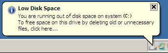
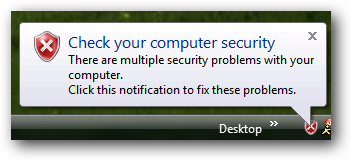
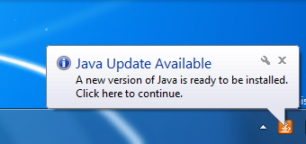

+++
title = "كيفية التخلص من الإشعارات المنبثقة المزعجة في الويندوز"
date = "2015-01-15"
description = "من أكثر الأشياء التي تضايق مستخدم الويندوز هي الإشعارات البالونية المنبثقة وخصوصا تلك التي لا تهم المستخدم في شيء مثل الرسالة الشهيرة Low Disk Space نقدم لك عزيزي القارئ الحل النهائي لهذه المشكلة."
categories = ["ويندوز",]
tags = ["موقع لغة العصر"]

+++

بداية تتعدد أسباب ظهور الرسالة:
فمنها ما يظهر بسبب عدم وجود مساحة كافية:

ومنها ما يظهر بسبب مشكلة في الحماية:

ومنها ما يظهر بسبب وجود التحديثات:

وتبقى طريقة الحل لهذه المشكلة واحدة وهي:

ملف ريجيسترى للتعديل في قيم اظهار هذه الإشعارات المزعجة وتعمل هذه الطريقة على جميع أنواع الويندوز.

قم بتحميل الملف [من هنا](http://goo.gl/7WN0Ls).

ثم قم بفك الضغط عن الملف لينتج ملفين وهما:

1. DisableNotificationBalloons.reg وهو المختص بإيقاف تشغيل هذه الإشعارات.
2. EnableNotificationBalloons.reg وهو المختص بتشغيل هذه الإشعارات.
   قم بفتح الملف الأول ثم اضغط Yes ثم OK.

---

هذا الموضوع نٌشر باﻷصل على موقع مجلة لغة العصر.

http://aitmag.ahram.org.eg/News/4009.aspx
