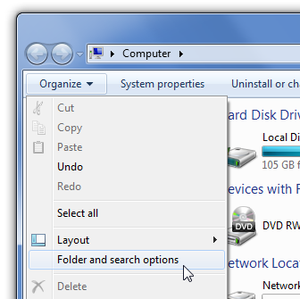
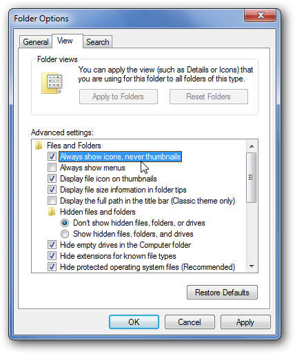

+++
title = "إيقاف المصغرات لزيادة سرعة متصفح الملفات في الويندوز"
date = "2015-05-30"
description = "إذا كنت تريد تشغيل متصفح الملفات في الويندوز Windows Explorer بسرعته القصوى فإن مصغرات الصور هي أول عائق يقف في طريقك، فهي تأخذ الكثير من الوقت في التحميل، إليك عزيزي القارئ طريقة ايقافها."
categories = ["ويندوز",]
tags = ["موقع لغة العصر"]

+++

إذا كنت تريد تشغيل متصفح الملفات في الويندوز Windows Explorer بسرعته القصوى فإن مصغرات الصور هي أول عائق يقف في طريقك، فهي تأخذ الكثير من الوقت في التحميل، إليك عزيزي القارئ طريقة ايقافها.

مثال للمصغرات وهي تعمل:

مقال للمصغرات بعد ايقافها:

**الطريقة الأولى: عن طريق** **Folder Options**:

1. قم بفتح My Computer ثم اضغط على الزر Organize.
2. قم باختيار Folder and search options.

3. اذهب الى التبويب View.
4. قم بوضع العلامة على الاختيار الأول Always show icons، never thumbnails.

5. اضغط OK.

**الطريقة الثانية: عن طريق ملف ريجيستري:**

1. قم بتحميل هذا الملف [من هنا.](http://www.sevenforums.com/attachments/tutorials/118266d1311789208-featured-previews-enable-disable-disable_explorer_thumbnails_all_users.reg)
2. قم بفتحه ثم اضغط Yes ثم OK.

ملاحظة: إذا أردت إعادة تشغيلها مرة أخرى [حمل هذا الملف](http://www.sevenforums.com/attachments/tutorials/118265d1311789208-thumbnail-previews-enable-disable-enable_explorer_thumbnails_all_users.reg)، ثم قم بنفس الخطوات السابقة

---

هذا الموضوع نٌشر باﻷصل على موقع مجلة لغة العصر.

http://aitmag.ahram.org.eg/News/16366.aspx
