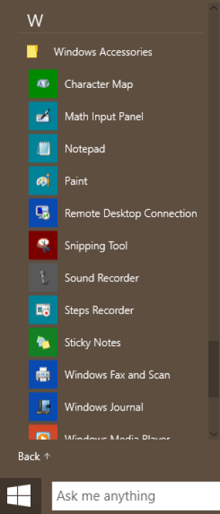

+++
title = "للمبتدئين.. طريقة التقاط صورة للشاشة في كل إصدارات الويندوز"
date = "2015-04-21"
description = "مما لا شك فيه أنك ستحتاج يوما ما إلى تصوير شاشة الكمبيوتر الخاص بك سواء لطلب المساعدة على الإنترنت أو لتقديم دورس أو غيرها، فهل تعلم أنه يمكنك أخذ لقطة من الشاشة بدون استخدام أي برامج؟."
categories = ["ويندوز",]
tags = ["موقع لغة العصر"]

+++

مما لا شك فيه أنك ستحتاج يوما ما الى تصوير شاشة الكمبيوتر الخاص بك سواء لطلب المساعدة على الانترنت أو لتقديم دورس أو غيرها، فهل تعلم أنه يمكنك اخذ لقطة من الشاشة بدون استخدام أي برامج؟ اليك عزيزي المبتدئ هذا الموضوع.

## الطريقة الأولى: باستخدام لوحة المفاتيح:

1. من لوحة المفاتيح قم بالضغط على زر _Print Screen_ من لوحة المفاتيح.
   أو اضغط _Alt + Print Screen_ لتصوير النافذة الفعالة الحالية.
   أو اضغط _Windows Key_ + _Print Screen_ لحفظ الشاشة الحالية تلقائيا في مجلد الصور (في ويندوز 8/8.1/10 فقط).

2. قم بفتح برنامج الرسام Paint، من قائمة البداية انتقل الى المجلد Accessories (في ويندوز 10 اسم المجلد Windows Accessories)، اضغط على البرنامج.

3. قم بلصق الصورة، من قائمة Edit قم باختيار Paste (Ctrl+V).
4. من قائمة File قم بحفظ الصورة بالضغط على Save (Ctrl+S)، يفضل أن تختار الصيغة Jpg/PNG.

---

هذا الموضوع نٌشر باﻷصل على موقع مجلة لغة العصر.

http://aitmag.ahram.org.eg/News/10376.aspx
