+++
title = "10 حيل سحرية لزيادة سرعة جهازك البطيء"
date = "2017-03-01"
description = "تصبح أجهزة الكمبيوتر التي تعمل بنظام ويندوز أبطأ مع مرور الوقت، وذلك بسبب العديد من الأشياء، وكما هو الحال مع جميع مشاكل أجهزة الكمبيوتر الشخصية، باستخدامك لبعض الحلول البسيطة سيعود جهازك كما كان عليه!"
categories = ["ويندوز",]
tags = ["مجلة لغة العصر"]

+++

تصبح أجهزة الكمبيوتر التي تعمل بنظام ويندوز أبطأ مع مرور الوقت، وذلك بسبب العديد من الأشياء، وكما هو الحال مع جميع مشاكل أجهزة الكمبيوتر الشخصية، باستخدامك لبعض الحلول البسيطة سيعود جهازك كما كان عليه!

## 1- استخدام برامج تنظيف المخلفات

وهي الخطوة الأولى التي يجب عليك البدء بها، لأن جميع البرامج التي توجد على جهازك تترك العديد من ملفات المخلفات أو الملفات المؤقتة التي تسبب مشكلة البطء، لذلك يمكنك استخدام برامج مثل CCleaner الذي يمكنك تحميله من هنا
https://www.piriform.com/ccleaner/download
أو برنامج CleanMyPC الذي يقوم بتنظيف جهازك أوتوماتيكيا
http://macpaw.7eer.net/c/156932/63819/1733?subId1=contentad&subId2=228570
أو برنامج Advanced SystemCare الموصي به من قبل cnet
http://www.iobit.com/en/advancedsystemcarefree.php

## 2- البحث عن البرامج التي تلتهم موارد جهازك

السبب الرئيسي في بطء سرعة وأداء الجهاز هو البرامج المثبتة، ففي بعض الأحيان عند إلقاء نظرة على مدير المهام Task Manager تجد أن استهلاك وحدة المعالجة المركزية قد وصل إلى 99% على سيبل المثال!

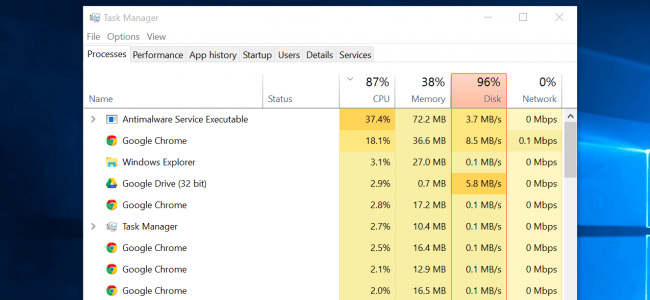

لذلك قم الآن بفتح Task Manager بالضغط بزر الماوس الأيمن على شريط المهام ثم Task Manager، أو بالضغط على Ctrl+Shift+Escape.
ستجد البرامج التي تعمل كما بالصورة السابقة، لاحظ استخدام كل من CPU وMemory وDisk، وإذا وجدت أي برنامج ذو استخدام عالي قم بإيقاف البرنامج بالطريقة العادية أو بالضغط على End Task.

## 3- إغلاق البرامج التي تعمل في الخلفية

يوجد الكثير من البرامج التي تعمل في ال Tray بجانب الساعة في شريط المهام، قم بالضغط على السهم ثم اضغط بزر الماوس الأيمن كما بالصورة، ثم اغلق البرامج التي لا تحتاجها لتوفير المزيد من الموارد.

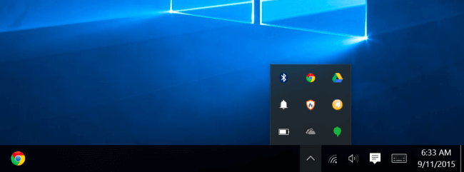

## 4- تعطيل البرامج التي تعمل عند التشغيل

يفضل دائما أن تقوم بمنع كل البرامج التي لا تحتاج من العمل عند بدء التشغيل، لأن ذلك يجعل الجهاز يستغرق وقتا أطول في الإقلاع، ولفعل ذلك قم بفتح مدير المهام Task Manager مرة أخري، ثم توجه إلى التبويب Startup.
حدد البرنامج الذي تريد تعطيله ثم اضغط على Disable.

## 5- تقليل الرسوم المتحركة:

يستخدم الويندوز مجموعة من المؤثرات والرسوم الانتقالية ما إلى ذلك، مثل مؤثرات تكبير أو تصغير النوافذ، ولتعطيل هذه المؤثرات قم بالضغط على Windows + X ثم اختر System ومن القائمة اليمني اضغط على Advanced System Settings.

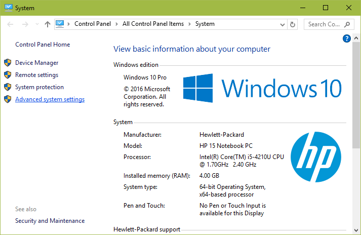

ثم من Performance اضغط على الزر Settings.

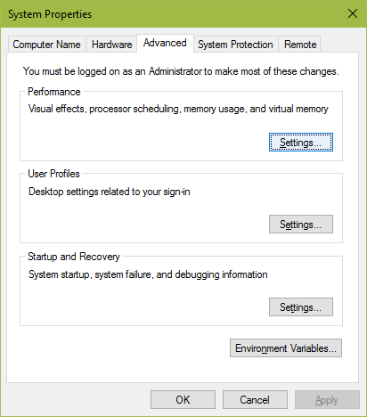

بعد ذلك اضغط على Adjust for best performance أو اضغط على Custom، وقم بتعطيل المؤثرات التي لا تريدها مثل Animate windows when minimizing and maximizing.

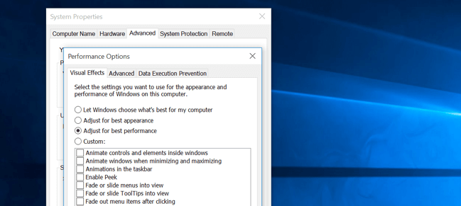

## 6- تخفيف متصفح الويب الخاص بك

إذا كنت تعاني من مشكلة بطء المتصفح، يمكنك إلقاء نظرة على الملحقات extensions والوظائف الإضافية add-ons، ستجد العديد منها بكل بساطة قم بتعطيل ما لا تحتاج منها.

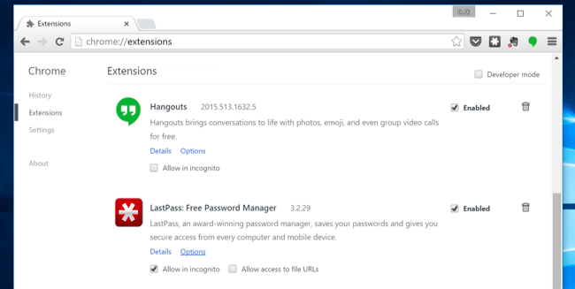

## 7- فحص جهازك من البرامج الضارة والإعلانات

قد يكون السبب وراء البطء هو وجود بعض البرامج الخبيثة أو الإعلانية، ولهذا أنصحك عزيزي القارئ أولا باستخدام أداة AdwCleaner التي تقوم بإزالة كل البرامج الخبيثة التي توجد على جهازك، قم بتحميلها من هنا https://toolslib.net/downloads/viewdownload/1-adwcleaner/
ثم بعد فتح الأداة اضغط Scan وانتظر حتى اكتمال الفحص واضغط Clean.

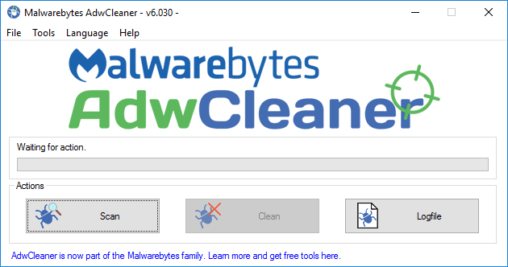

ثانيا: قم بتثبيت برنامج Malwarebytes لحماية جهازك من كل البرمجيات الخبيثة، يمكنك تحميله من هنا https://www.malwarebytes.com/mwb-download/

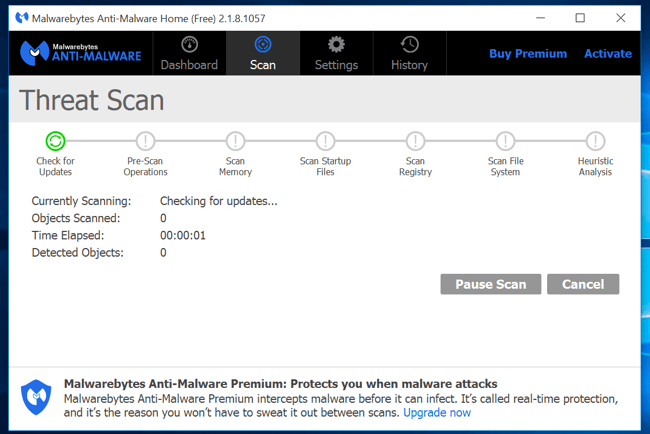

## 8- تفريغ بعض مساحة القرص الصلب

كلما قلت المساحة الخالية في جهازك، كلما قلت سرعته، لذلك يجب عليك أن تحرص دائما على تفريغ بعض المساحة من القرص الصلب، ويمكنك استخدام أداة Disk Cleanup عن طريق كتابة هذا الأمر في مربع Run `c:\windows\SYSTEM32\cleanmgr.exe /dDrive`

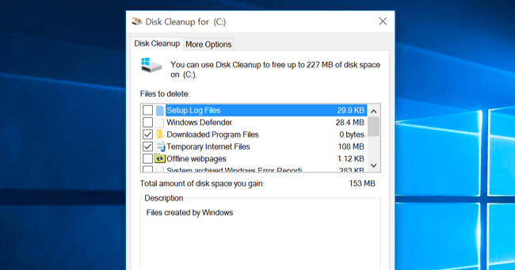

## 9- إلغاء تجزئة القرص الصلب

بالرغم أن خطوة إلغاء التجزئة غير ضرورية في الإصدارات الحديثة من الويندوز، إلا أنها تبقى مفيدة لمن يلاحظ بطء أثناء نقل الملفات وما إلى ذلك من مشاكل القرص الصلب، ويمكنك الوصول إلى أداة Defragmenter tool عن طريق الضغط بزر الماوس الأيمن على أي قرص صلب ثم اختيار Properties ثم Tools واضغط الزر Optimize.

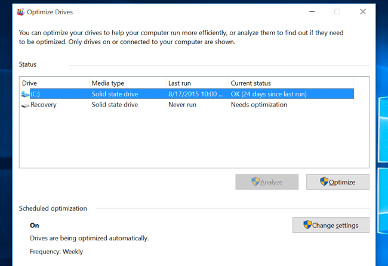

## 10- إلغاء تثبيت البرامج التي لا تحتاجها:

قم بفتح لوحة التحكم Control Panel ثم Programs and features ستجد قائمة البرامج المثبتة على جهازك، وهنا يجب عليك إزالة كل برنامج لا تستخدمه وستلاحظ الفرق في أداء جهازك.

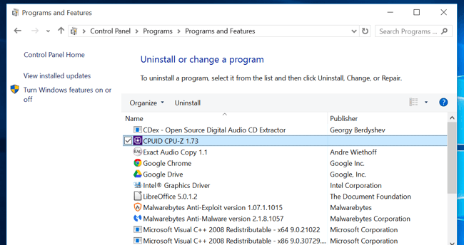

## لم تنجح كل الخطوات السابقة؟ قم بإعادة تثبيت الويندوز!

وهو الحل الذي يجب عليك القيام به في حالة عد نجاح كل ما سبق من طرق، فقد تكون المشكلة من نسخة الويندوز الخاصة بك، وخاصة إذا كانت نسخة ويندوز مقرصنة.
فإذا كنت تستخدم ويندوز 8.1 أو ويندوز 10 يمكنك أن تقوم بعمل إعادة ضبط للويندوز عن طريق تطبيق الإعدادات ثم Update & Security وأخيرا التبويب Recovery، ستجد الاختيار Reset your PC اضغط عليه واتبع التعليمات لإكمال عملية إعادة الضبط.

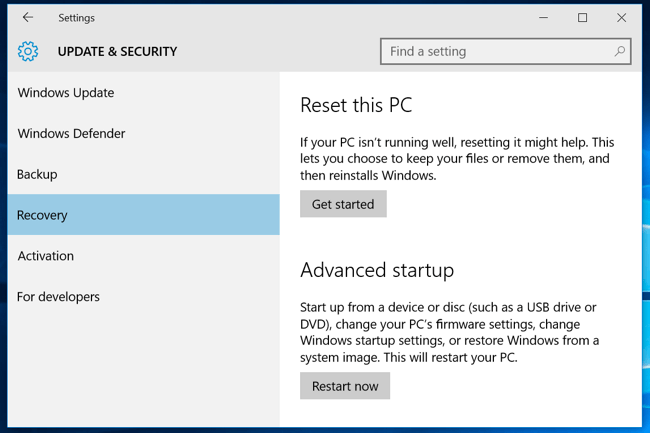

---

هذا الموضوع نُشر باﻷصل في مجلة لغة العصر العدد 195 شهر 3-2017 ويمكن الإطلاع عليه [هنا](https://drive.google.com/file/d/1d8dNqOyFKJy8A-jBf5-XhIDuZvDbpGrB/view?usp=sharing).

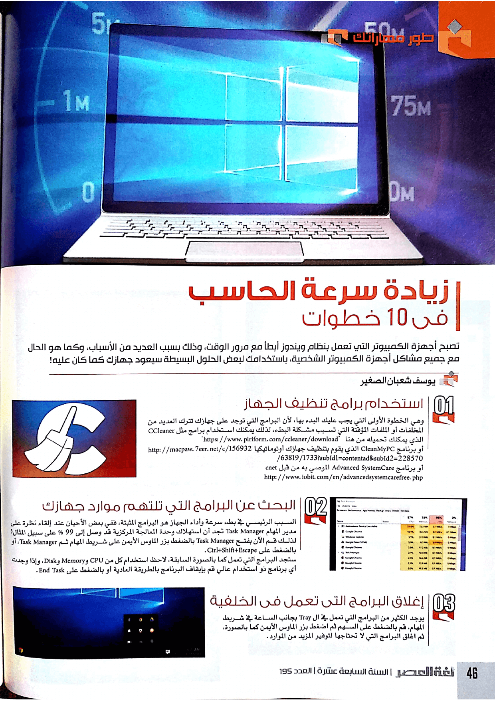

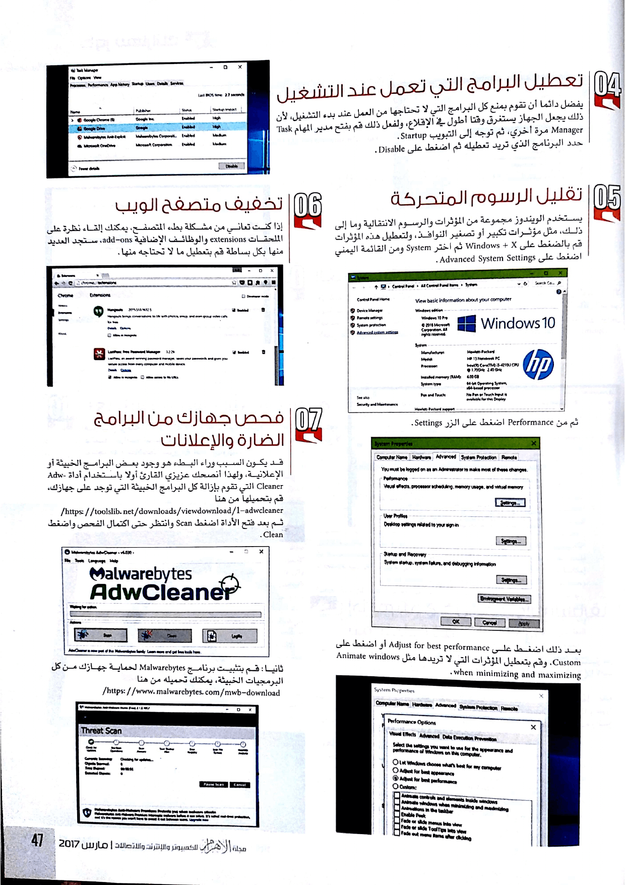

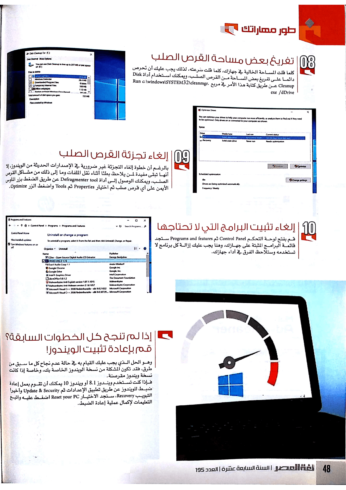
