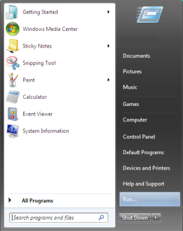

+++
title = "معرفة تاريخ تثبيت الويندوز على جهازك"
date = "2014-09-04"
description = "تعرف علي آخر مرة قمت فيها بتثبيت الويندوز على جهازك."
categories = ["مهارات رقمية",]
tags = ["موقع لغة العصر"]

+++

1.  من قائمة Startاختر Run.

أو اضغط على الزرين Windows + Rثم أكتب Cmdواضغط Enter

2. ستظهر شاشة سوداء قم بكتابة هذا الأمر systeminfoوانتظر
   حتى يقوم بإظهار المعلومات

سوف يظهر تاريخ تثبيت الويندوز في جهازك في السطر 8 كما هو موضح في الصورة

---

هذا الموضوع نٌشر باﻷصل على موقع مجلة لغة العصر.
