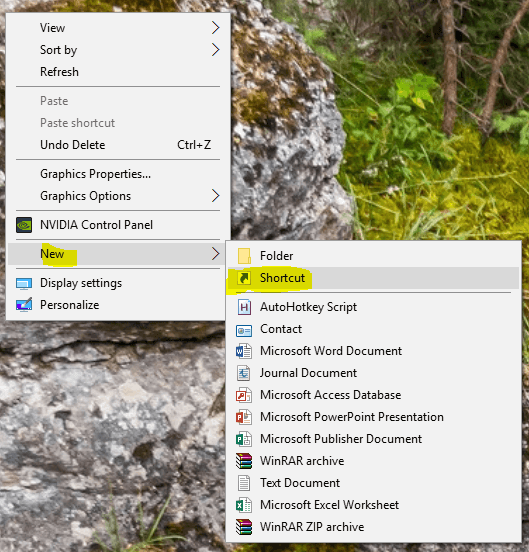
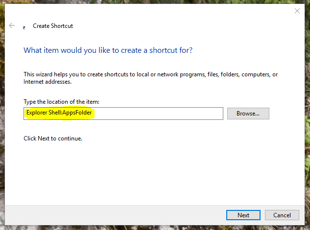
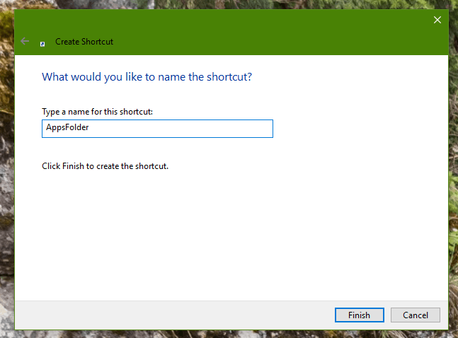
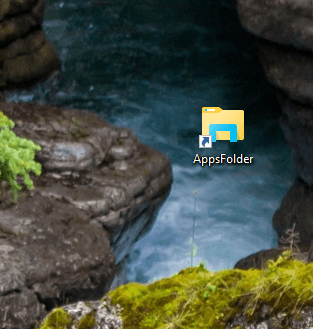
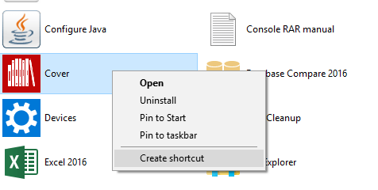

+++
title = "أسرع طريقة للوصول إلى كل البرامج على جهازك بنقرة زر!"
date = "2016-05-25"
description = "عندما نريد فتح برنامج فإننا دائما نتجه إلى قائمة البداية، من منا لم يمل من البحث عن البرنامج الذي يريده، ولهذا أقدم لك عزيزي القارئ حيلة سحرية للوصول لأي برنامج تريده بنقره واحدة من سطح المكتب مباشرة."
categories = ["مهارات رقمية", "ويندوز",]
tags = ["موقع لغة العصر"]
images = ["images/2016-635997803838265304-826_thumb705x335.png"]

+++

عندما نريد فتح برنامج فإننا دائما نتجه إلى قائمة البداية، من منا لم يمل من البحث عن البرنامج الذي يريده، ولهذا أقدم لك عزيزي القارئ حيلة سحرية للوصول لأي برنامج تريده بنقره واحدة من سطح المكتب مباشرة.

سنقوم بهذه الحيلة عن طريق عمل اختصار على سطح المكتب يظهر لنا عند فتحه كل البرامج المثبتة على الجهاز الخاص بك.

1- قم بالضغط بزر الماوس الأيمن على سطح المكتب ثم اختر Shortcut من قائمة New.

2- قم بكتابة Explorer Shell:AppsFolder في المربع كما بالصورة ثم اضغط Next.

3- اكتب اسم الاختصار كما تريد ثم اضغط Finish.

4- سيظهر لك الاختصار على سطح المكتب.

5- قم بفتحه لتظهر لك كل البرامج الموجودة على جهازك، يمكنك أيضا أن تقوم بإنشاء اختصار لأي تطبيق أو برنامج أمامك ليظهر على سطح المكتب.

---
هذا الموضوع نٌشر باﻷصل على موقع مجلة لغة العصر.