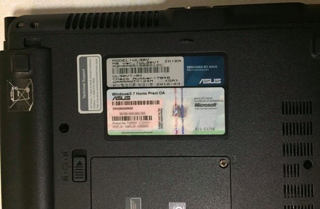
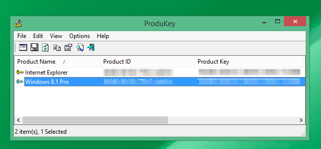

+++
title = "كيف تسترجع مفتاح نسختك الأصلية من الويندوز"
date = "2015-03-19"
description = "بالتأكيد قد تحتاج يوما ما لإعادة تثبيت نسخة الويندوز على جهازك ولكن المشكلة تكون إذا كانت النسخة المثبتة على جهازك هي النسخة الأصلية التي جاء بها الجهاز، نقدم لك عزيزي القارئ طريقة استرجاع مفتاح نسختك الأصلية من الويندوز Serial Key"
categories = ["ويندوز",]
tags = ["موقع لغة العصر"]
images = ["images/2015-635623856768875782-887.png"]

+++

بالتأكيد قد تحتاج يوما ما لإعادة تثبيت نسخة الويندوز على جهازك ولكن المشكلة تكون إذا كانت النسخة المثبتة على جهازك هي النسخة الأصلية التي جاء بها الجهاز، نقدم لك عزيزي القارئ طريقة استرجاع مفتاح نسختك الأصلية من الويندوز Serial Key.

## أين يمكن أن تجد مفتاح نسخة الويندوز؟

1. مخزن على برنامج داخل جهازك، سواء كان برنامج وضعته الشركة المصنعة أم داخل ملفات الريجسترى registry.
2. مطبوع على ملصق، غالبا ما يكون أسفل اللاب توب، ويكون هذا الملصق موجود بكثره مع اجهزه اللاب توب التي تعمل بنظام ويندوز 7.

## كيف يمكن استرجاع مفتاح النسخة؟

1. قم بتحميل برنامج ProduKey من [موقعه الرسمي](http://www.nirsoft.net/utils/product_cd_key_viewer.html)، البرنامج متاح باللغة العربية.
2. بمجرد أن يفتح البرنامج ستظهر لك المنتجات المثبتة على جهازك وكود المنتج ومفتاح التسجيل الخاص به.

قم بالاحتفاظ بالمفتاح الخاص بالويندوز في مكان آمن لتستخدمه عند الاحتياج اليه.

---
هذا الموضوع نٌشر باﻷصل على موقع مجلة لغة العصر.

http://aitmag.ahram.org.eg/News/7584.aspx