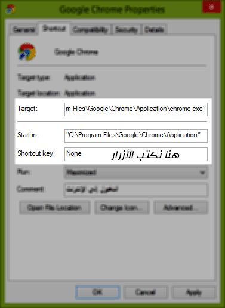

+++
author = "yshalsager"
title = "كيفية تشغيل برامجك المفضلة بواسطة ضغط بضعة أزرار في ويندوز"
date = "2014-07-07"
description = "طريقة بسيطة وبدون برامج لتشغيل برامجك المفضلة بواسطة ضغط بضعة أزرار."
categories = ["ويندوز",]
tags = ["حيل", "افهم تكنولوجيا"]

+++

السلام عليكم ورحمة الله وبركاته:

إليكم شرح لطريقة بسيطة وبدون برامج لتشغيل برامجك المفضلة بواسطة ضغط بضعة أزرار:

**الخطوات:**

- اذهب إلى أيقونة الاختصار الخاص برنامجك المفضل واضغط بزر الفأرة الأيمن على الأيقونة ثم اختر (properties)
- أمام كلمة none أدخل الأزرار التي تريد تشغيل برنامجك بواسطتها فمثلا بإمكانك أن تدخل الآتي (Ctrl + Alt + A) أو (Ctrl +Shift+ D) أو (Ctrl +Alt+ C) أو أي زر آخر بشرط عدم استخدام الأزرار التالية (Esc Tab , Enter , Space Bar , Print Screen , Back Space)
- بعد اختيار الأزرار أضغط موافق ثم جرب.

**الشرح بالصور:**

---

هذا المقال نشر باﻷصل على مدونة افهم تكنولوجيا ويمكنك اﻹطلاع عليه [هنا](https://efhamtechnology.blogspot.com/2014/07/prog-by-3button.html).
