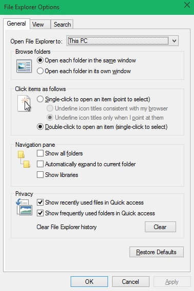
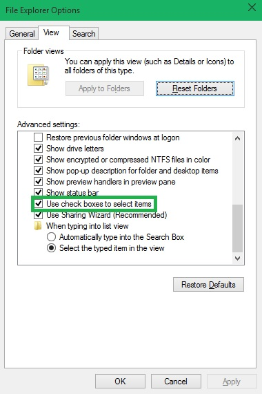
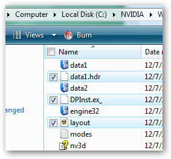

+++
title = "إضافة ميزة تحديد الملفات عبر مربعات الاختيار إلى الويندوز"
date = "2015-05-15"
description = "حيل وأسرار الويندوز نهر لا يتوقف، وقد قدمنا في الفترة السابقة العديد من الدروس التي نكشف فيها أسرار الويندوز، نتابع اليوم سلسلة دروس الويندوز عزيزي القارئ ونقدم لك طريقة إضافة ميزة تحديد الملفات عبر مربعات الاختيار إلى متصفح الملفات في الويندوز."
categories = ["ويندوز",]
tags = ["موقع لغة العصر"]
images = ["images/2015-635673143914723266-472.png"]

+++

حيل وأسرار الويندوز نهر لا يتوقف، وقد قدمنا في الفترة السابقة العديد من الدروس التي نكشف فيها أسرار الويندوز، نتابع اليوم سلسلة دروس الويندوز عزيزي القارئ ونقدم لك طريقة إضافة ميزة تحديد الملفات عبر مربعات الاختيار إلى متصفح الملفات في الويندوز.

قامت مايكروسوفت ابتداء من Windows Vista بإضافة ميزة جديدة مخفية في متصفح الملفات تتيح للمستخدم تحديد الملفات عن طريق مربعات الاختيار بدلا من الضغط على زر Ctrl وزر الفأرة الأيسر لتحديد الملف، اليكم طريقة تفعيلها.

1. قم بفتح إعدادات المجلدات Folder Options من داخل لوحة التحكم Control Panel.

2. انتقل الى التبويب View ثم قم باختيار Use check boxes to select items.
3. اضغط موافق OK.

4. الآن بمجرد الضغط على مربع الاختيار بجانب اسم الملف يمكنك تحديده.

---
هذا الموضوع نٌشر باﻷصل على موقع مجلة لغة العصر.

http://aitmag.ahram.org.eg/News/15436.aspx