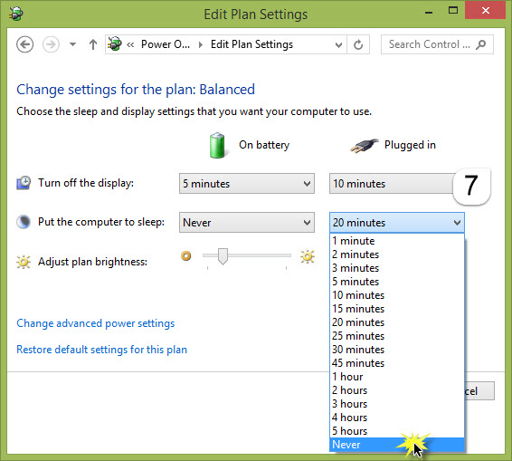

+++
title = "كيفية التحكم في وضع النوم في ويندوز"
date = "2015-01-23"
description = "قد تترك الكمبيوتر الخاص بك أو حاسبك المحمول مفتوحا لكي يقوم بتحميل ملف أو عمل فحص للفيروسات أو تنفيذ بعض المهام وتذهب لفعل بعض الأشياء وعندما تعود تجد المفاجأة وهي أن الكمبيوتر أو الحاسب المحمول قد دخل في وضع الخمول Sleeping mode بشكل افتراضي والمهمة التي كان يقوم بها قد توقفت."
categories = ["ويندوز",]
tags = ["موقع لغة العصر"]
images = ["images/2015-635575578459599569-959.jpg"]

+++

قد تترك الكمبيوتر الخاص بك أو حاسبك المحمول مفتوحا لكي يقوم بتحميل ملف أو عمل فحص للفيروسات أو تنفيذ بعض المهام وتذهب لفعل بعض الأشياء وعندما تعود تجد المفاجأة وهي أن الكمبيوتر أو الحاسب المحمول قد دخل في وضع الخمول Sleeping mode بشكل افتراضي والمهمة التي كان يقوم بها قد توقفت.

نقدم لك عزيزي القارئ حل بسيط لهذه المشكلة.

- قم بفتح قائمة البداية Start Menu.
- قم بالدخول الى Control Panel.
- قم باختيار Power Options.

ستظهر لك نافذة إعدادات الطاقة Power Options قم بالضغط على Change when the computer sleeps.

سنقوم بتعديل الوقت الذي بعده يدخل الكمبيوتر في وضع الخمول Put the computer to sleep كما بالصورة.

قم بتعديل القيمة الموجودة تحت On Battery إلى Never.

ثم قم أيضا بتعديل القيمة الموجودة تحت Plugged in إلى Never.

وأخيرا قم بالضغط على Save changes لحفظ التغييرات.

---
هذا الموضوع نٌشر باﻷصل على موقع مجلة لغة العصر.

http://aitmag.ahram.org.eg/News/4350.aspx