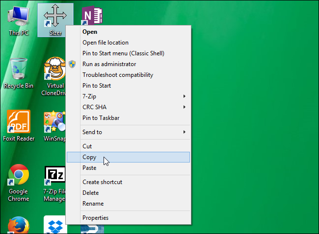
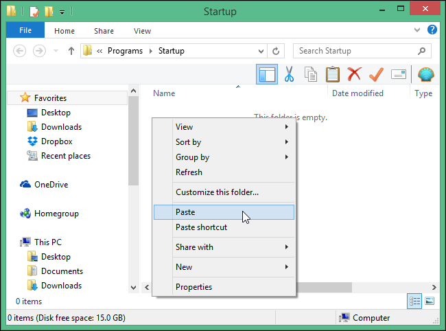
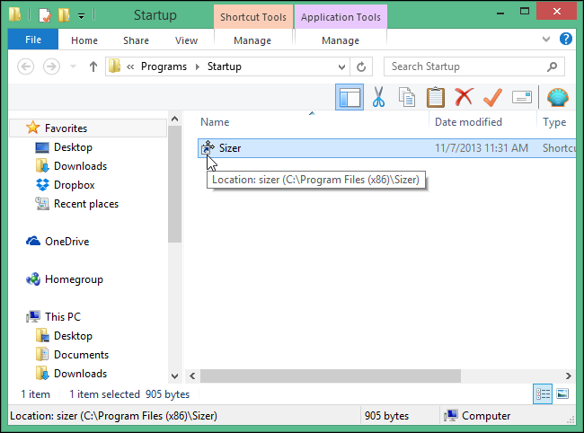
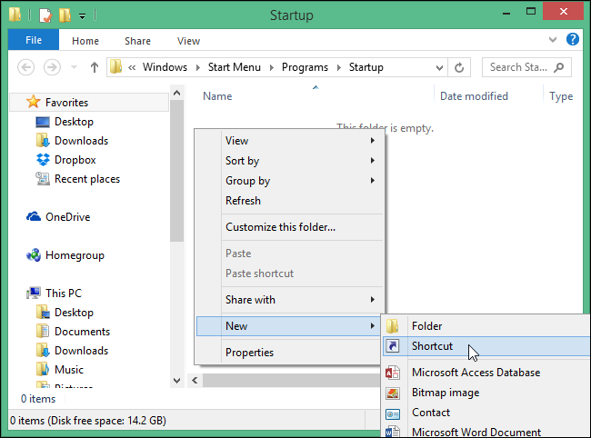
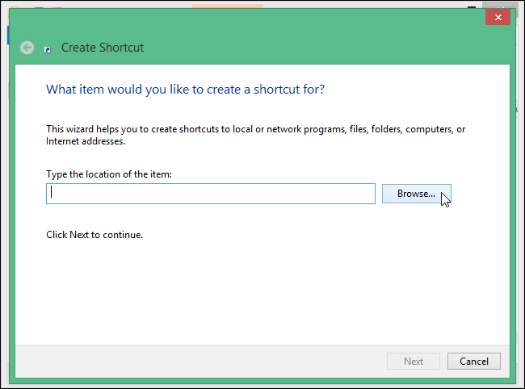
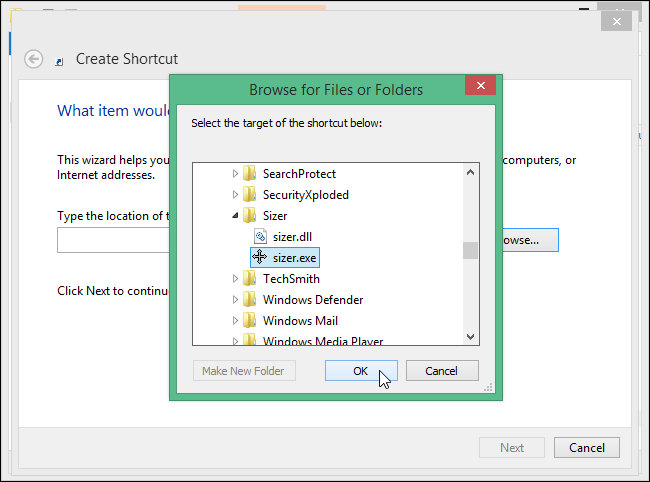
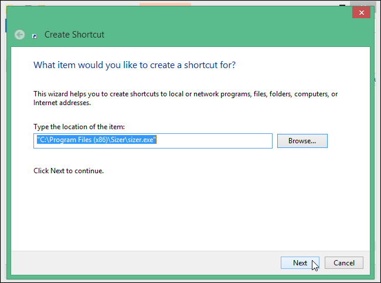
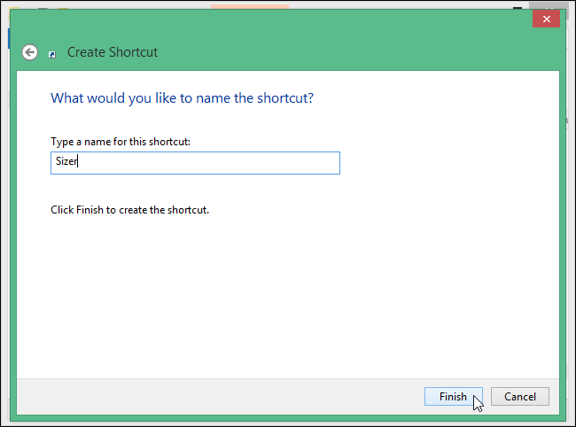

+++
title = "طريقة إضافة البرنامج لتعمل مع بدء تشغيل ويندوز"
date = "2015-03-31"
description = "كثير من البرامج في الويندوز تقوم بإضافة نفسها تلقائيا لتعمل مع بدء تشغيل الويندوز، ولكن قد تحتاج أنت أيضا الى إضافة البرامج، الملفات، أو المجلدات الخاصة بك لتعمل تلقائيا، نقدم لك عزيزي القارئ الطريقة الجديدة لإضافة البرامج الى Startup في ويندوز 8.1."
categories = ["ويندوز",]
tags = ["موقع لغة العصر"]

+++

كثير من البرامج في الويندوز تقوم بإضافة نفسها تلقائيا لتعمل مع بدء تشغيل الويندوز، ولكن قد تحتاج أنت أيضا الى إضافة البرامج، الملفات، أو المجلدات الخاصة بك لتعمل تلقائيا، نقدم لك عزيزي القارئ الطريقة الجديدة لإضافة البرامج الى Startup في ويندوز 8/8.1/10.

لإضافة برنامج الى Startup تحتاج الى اضافة الاختصار الخاص به يدويا الى مجلد Startup الذي كان موجود سابقا في قائمة البداية، ولكن منذ إطلاق ويندوز 8 اختلفت الطريقة وصارت صعبة نسيبا.

## أولا: إذا كان البرنامج له اختصار على سطح المكتب:

1. قم بالضغط بزر الفأرة الأيمن على البرنامج الذي تريد اضافته ثم اختر "نسخ Copy".

2. قم بفتح مربع Run عن طريق الضغط على زر ويندوز + R، ثم اكتب الامر " shell:startup" بدون علامتي التنصيص، ثم اضغط OK.

3. في مكان فارغ قم بالضغط على زر الفأرة الأيمن ثم اختر "لصق Paste".

4. ستجد أن الاختصار قد تمت اضافته الى المسار "Startup".

## ثانيا: إذا لم يوجد للبرنامج اختصار على سطح المكتب:

1. قم بالدخول الى هذا المسار عن طريق اضافته في شريط العنوان:
   C:\Users\USERNAME\AppData\Roaming\Microsoft\Windows\Start Menu\Programs\Startup
   مع استبدال USERNAME باسم المستخدم الخاص بك.
2. قم بالضغط على زر الفأرة الأيمن في مكان فارغ ثم من قائمة New اختر "اختصار Shortcut".

3. ستظهر لك النافذة كما بالصورة اضغط على "استعراض Browse".

4. ثم باختيار المسار الخاص بالبرنامج الذي تريد اضافته ثم اضغط OK.

5. بعد اختيار المسار قم بالضغط على "التالي Next".

6. قم بكتابة اسم الاختصار ثم اختر "إنهاء Finish".

وبهذا عندما يقوم الويندوز بالفتح مرة أخرى ستفتح البرامج التي قمت باضافتها بشكل اوتوماتيكي.

---

هذا الموضوع نٌشر باﻷصل على موقع مجلة لغة العصر.

http://aitmag.ahram.org.eg/News/8638.aspx
