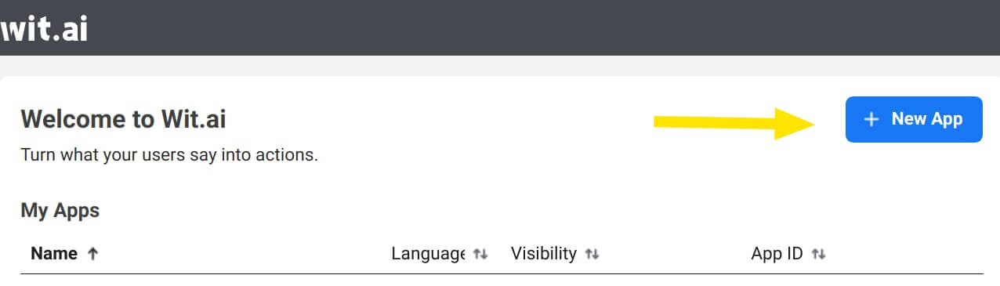
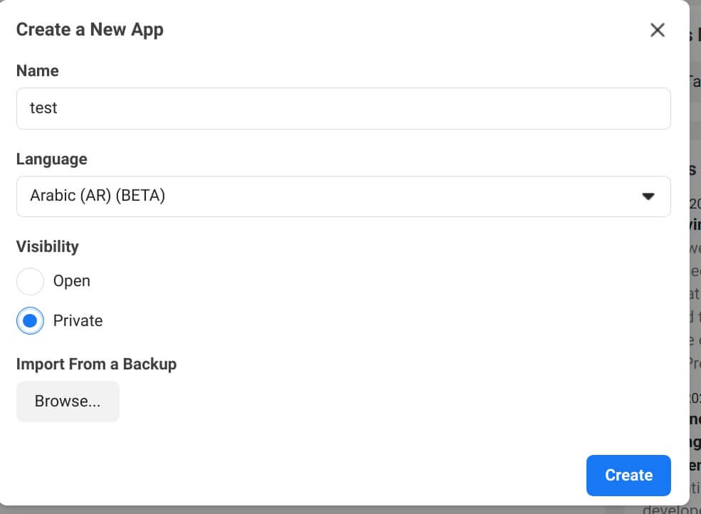
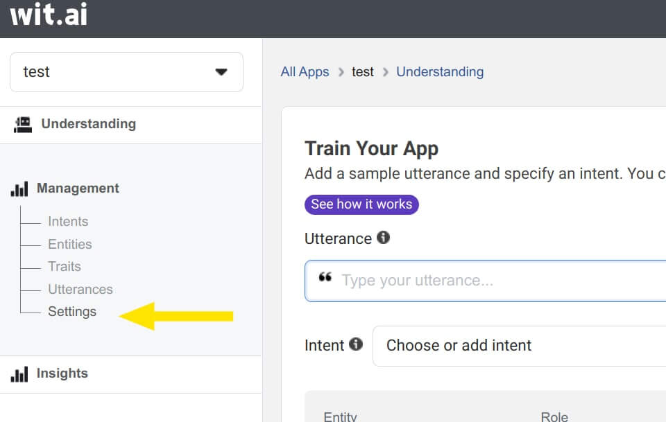
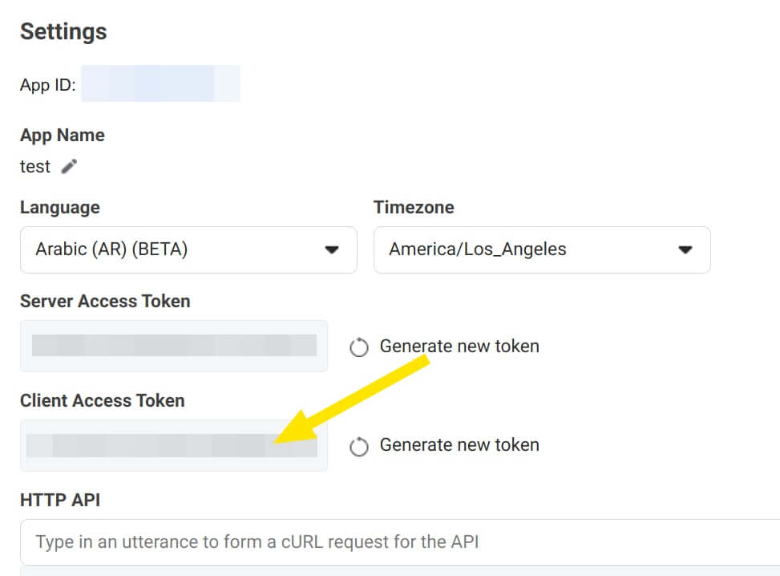
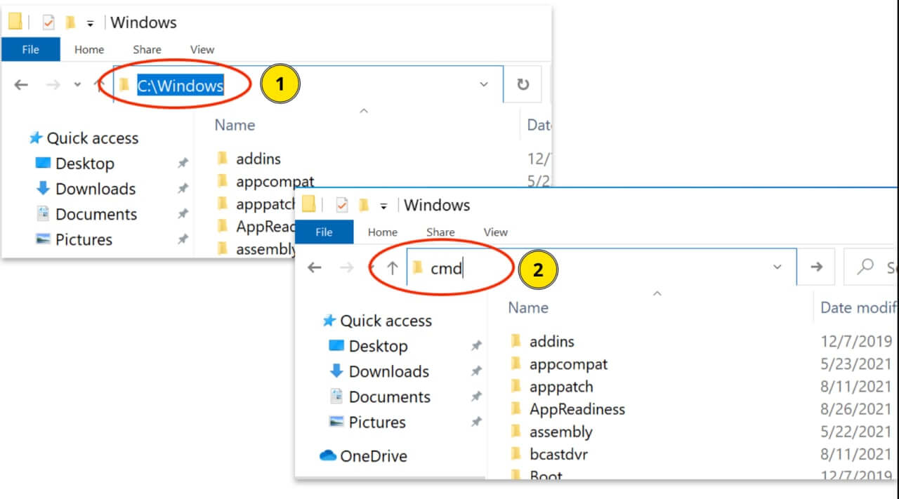
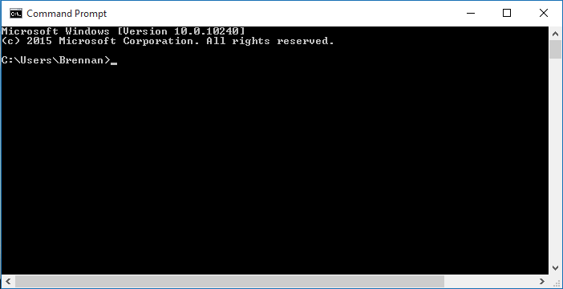

+++
author = "yshalsager"
title = "أداة تحويل الصوت إلى كلام باستخدام خدمة wit.ai"
date = "2022-03-08"
description = "هناك العديد من خِدْمَات تحويل الصوت إلى كلام على اﻹنترنت، لكن القليل منها يدعم اللغة العربية بدقة عالية. ومن هذا القليل خدمة wit.ai التي تعرفت إليها حديثًا (وهي من تطوير فيس بوك للأسف) وتوفر العديد من اﻷمور المتعلقة بمعالجة اللغات الطبيعية ومن ضمنها تحويل الصوت إلى كلام مجانا مع دعم عدد كبير جدا من اللغات. وقد جربت اﻷداة في تفريغ الدروس العلمية ووجدت أن دِقَّة التفريغ جيدة جدا لذلك أنشأت أداة صغيرة لتفريغ الملفات الصوتية بالاعتماد على خدمة wit.ai."
categories = ["مشاريعي", "مهارات رقمية"]
tags = ["المدونة",]

+++

هناك العديد من خِدْمَات تحويل الصوت إلى كلام على اﻹنترنت، لكن القليل منها يدعم اللغة العربية بدقة عالية. ومن هذا القليل خدمة wit.ai التي تعرفت إليها حديثًا (وهي من تطوير فيس بوك للأسف) وتوفر العديد من اﻷمور المتعلقة بمعالجة اللغات الطبيعية ومن ضمنها تحويل الصوت إلى كلام مجانا مع دعم عدد كبير جدا من اللغات. وقد جربت اﻷداة في تفريغ الدروس العلمية ووجدت أن دِقَّة التفريغ جيدة جدا لذلك أنشأت أداة صغيرة لتفريغ الملفات الصوتية بالاعتماد على خدمة wit.ai.


## اﻷدوات البديلة

هناك عدد من الأدوات الموجودة فعلًا التي إما تستخدم خدمة wit.ai مثل بوتات تليجرام [TranscriberBot](https://github.com/charslab/TranscriberBot) و [voicy](https://github.com/backmeupplz/voicy)، أو تستخدم خِدْمَات جوجل وغيرها لتحويل الكلام إلى نص مثل [pyTranscriber](https://github.com/raryelcostasouza/pyTranscriber) و [autosub](https://github.com/BingLingGroup/autosub). لكن المشكلة في المجموعة اﻷولى هي كونها مرتبطة بتليجرام فقط، والثانية أنها لا تدعم خدمة wit التي تتعامل مع اللغة العربية بشكل جيد.


## أداة Wit Transcriber

هي أداة سطر أوامر بسيطة تتعامل مع الواجهة البرمجية الخاصة بخدمة wit.ai وتحديدا الجزء الذي يوفر تحويل الكلام إلى نص. اﻷداة مكتوبة باستخدام Python3 ومكتبات [httpx](https://www.python-httpx.org/) و [pydub](https://github.com/jiaaro/pydub) (لتحويل الملفات الصوتية باستخدام [FFmpeg](https://ffmpeg.org/)). تحول الأداة أي مِلَفّ صوت أو فيديو يحدده المستخدم إلى الصيغة الصوتية الملائمة للواجهة البرمجية الخاصة ب wit.ai ثم تقسم المِلَفّ إلى أجزاء صغيرة وأخيرا ترفعها إلى خدمة wit.ai وتستقبل التفريغ النصي ثم تجمعه في مِلَفّ واحد.

اﻷداة مفتوحة المصدر وموجودة هنا: https://github.com/yshalsager/wit_transcriber

### إعداد Wit.ai

1. افتح wit.ai وسجل الدخول بحساب فيس بوك.

   

2. اضغط على New App لإنشاء تطبيق جديد.

   

3. اختر اسمًا للتطبيق واختر لغةَ ثم عدل إعدادات ظهور التطبيق إلى خاص واضغط إنشاء.

   

4. افتح قسم اﻹدارة ثم اﻹعدادات Management > Settings.

   

5. أسفل قسم Client Access Token section ستجد مفتاح استخدام الواجهة البرمجية، انسخه لتستخدمه في الخطوة التالية.

   

### تحميل اﻷداة

يمكن لمن يستطيع التعامل مع بايثون نسخ مستودع [الكود](https://github.com/yshalsager/wit_transcriber) واستخدام اﻷداة. ولمن لا يستطيع ذلك يمكنه تحميل المِلَفّ التنفيذي الخاص باﻷداة سواء على نظام ويندوز أو لينكس.

**ملاحظة:** يجب تثبيت ffmpeg على لينكس لاستخدام اﻷداة، أما ويندوز فممكن تحميل الملفات التنفيذية من الرابط في الخطوة التالية.

1. حمل مِلَفّ اﻷداة التنفيذي من هنا ([ويندوز](https://github.com/yshalsager/wit_transcriber/releases/latest/download/wit_transcriber.exe) - [لينكس](https://github.com/yshalsager/wit_transcriber/releases/latest/download/wit_transcriber)) وضعه في مجلد جديد.
2. حمل ملفات ffmpeg إذا كنت تستخدم ويندوز من [هنا](https://www.gyan.dev/ffmpeg/builds/ffmpeg-release-essentials.7z)، ثم فك الضغط عنها وانسخ الملفات الموجودة في bin إلى نفس مكان مِلَفّ wit_transcriber)

### إعداد الأداة

اﻵن يجب وضع مفتاح استخدام واجهة wit.ai الذي حصلنا عليه في الخطوة اﻷولى.

- في نفس مكان مِلَفّ wit_transcriber ننشيء مِلَفّ جديد اسمه `config.json` (وليس `config.json.txt`) وننسخ بداخله التالي مع استبدال xxxxxxxx بClient Access Token الذي حصلنا عليه في الخطوة 1-5 ثم نحفظ المِلَفّ.

```json
{
  "ar": "xxxxxxxxxxxxxx"
}
```

- ويمكنك إضافة لغات أخرى بنفس الطريقة.

### تشغيل واستخدام الأداة

1. نحن الآن داخل مجلد الأداة والذي به مِلَفّ wit_transcriber.

2. نضغط على شريط العنوان (1 بالصورة) ثم نكتب cmd كما هو موضح بصورة 2 ثم نضغط زر enter.

   

3. ننسخ المِلَفّ المراد تفريغه إلى نفس مجلد الأداة ونسميه باسم ليس به مسافات ولا حروف عربية.

4. بداخل شاشة موجه الأوامر نكتب التالي لتشغيل الأداة `wit_transcriber.exe -i filename.extension` مع استبدال كلمة filename باسم المِلَفّ المراد تفريغه مع صيغة الملف.

   

**ملاحظة:** الخطوات من 1-3 مطلوبة فقط أول مرة بعد ذلك لاستخدام الأداة في أي وقت تتبع الخطوات بداية من 4 (تشغيل واستخدام الأداة) فقط.

```bash
usage: wit_transcriber.py [-h] -i INPUT [-o OUTPUT] [-c CONFIG] [-x CONNECTIONS] [-l LANG] [-v]

options:
  -h, --help            show this help message and exit
  -i INPUT, --input INPUT
                        Path of media file to be transcribed.
  -o OUTPUT, --output OUTPUT
                        Path of output file.
  -c CONFIG, --config CONFIG
                        Path of config file.
  -x CONNECTIONS, --connections CONNECTIONS
                        Number of API connections limit.
  -l LANG, --lang LANG  Language to use.
  -v, --verbose         Print API responses.
```

## مزيد من التحسينات

- تحتاج اﻷداة اﻵن إلى واجهة رسومية تجعل استخدامها سهلا لكل أنواع المستخدمين، ولعلي أعمل على ذلك قريبا إن تيسر إن شاء الله.
- يمكن استخدام [أداة مدقق صخر](https://github.com/yshalsager/tadqeek_sakhr) لتصليح الأخطاء اللغوية الموجودة في التفريع النصي بشكل آلي وتوفير وقت وجهد كبيرين.
