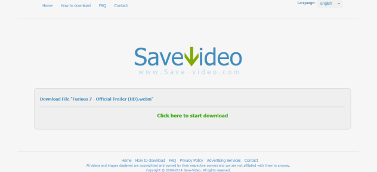

+++
title = "طريقة سحرية جديدة للتحميل من اليوتيوب"
date = "2015-05-13"
description = "مما لا شك فيه أننا نحتاج في كثير من الأوقات إلى تحميل بعض مقاطع الفيديو من اليوتيوب، وتتعدد الطرق لفعل ذلك، فبإمكانك استخدام برامج أو مواقع مخصصة للتحميل من اليوتيوب، أو استخدام هذه الحيلة الجديدة التي نقدمها لك عزيزي القارئ في هذا الموضوع."
categories = ["مهارات رقمية",]
tags = ["موقع لغة العصر"]

+++

مما لا شك فيه أننا نحتاج في كثير من الأوقات إلى تحميل بعض مقاطع الفيديو من اليوتيوب، وتتعدد الطرق لفعل ذلك، فبإمكانك استخدام برامج أو مواقع مخصصة للتحميل من اليوتيوب، أو استخدام هذه الحيلة الجديدة التي نقدمها لك عزيزي القارئ في هذا الموضوع.

1. في البداية قم بالدخول على رابط الفيديو الذي تريد تحميله.

2. قم بكتابة كلمة MAGIC بين كلمتيّ You وTube ليصبح الرابط كما بالصورة:

3. الآن سوف تُحول تلقائيا إلى موقع للتحميل من اليوتيوب، قم بالضغط على زر Download Video.

4. ستجد العديد من الصيغ المتاحة مثل Mp4-Webm-Flv-3gp-Mp3، قم بالضغط على الصيغة التي تريد تحمليها.

5. سينقلك الموقع الآن إلى صفحة التحميل، اضغط على Click here to start download ليبدأ التحميل.

---

هذا الموضوع نٌشر باﻷصل على موقع مجلة لغة العصر.

http://aitmag.ahram.org.eg/News/15184.aspx
